# Arena Game Flow - LangGraph Architecture

This document describes the LangGraph-based flow for the Arena game orchestration system.

## Overview

The Arena game uses LangGraph to orchestrate multi-agent conversations and competitions. The flow is designed as a state machine with clear phases, decision points, and recovery mechanisms.

## Graph Architecture

```mermaid
graph TB
    START([🎮 START]) --> SETUP[🔧 SETUP]
    SETUP --> TURN_START[🔄 TURN_START]
    
    TURN_START --> AGENT_SELECT[👥 AGENT_SELECT]
    AGENT_SELECT --> AGENT_ACTION[🎯 AGENT_ACTION]
    AGENT_ACTION --> MESSAGE_PROCESS[💬 MESSAGE_PROCESS]
    MESSAGE_PROCESS --> SCORING[📊 SCORING]
    SCORING --> ELIMINATION_CHECK{❓ ELIMINATION_CHECK}
    
    ELIMINATION_CHECK -->|elimination_pending| ELIMINATION[❌ ELIMINATION]
    ELIMINATION_CHECK -->|no elimination| PHASE_CHECK{🎯 PHASE_CHECK}
    
    ELIMINATION --> PHASE_CHECK
    
    PHASE_CHECK -->|game_over| GAME_END[🏁 GAME_END]
    PHASE_CHECK -->|continue| TURN_END[⏹️ TURN_END]
    
    TURN_END -->|should_continue| TURN_START
    TURN_END -->|game_over| GAME_END
    
    GAME_END --> END_STATE([🎯 END])
    
    %% Error handling
    AGENT_ACTION -.->|error| ERROR[🔥 ERROR]
    MESSAGE_PROCESS -.->|error| ERROR
    SCORING -.->|error| ERROR
    ERROR --> END_STATE
    
    %% Styling
    classDef startEnd fill:#e1f5fe
    classDef process fill:#f3e5f5
    classDef decision fill:#fff3e0
    classDef critical fill:#ffebee
    classDef narrator fill:#e8f5e8
    
    class START,END_STATE startEnd
    class SETUP,TURN_START,AGENT_ACTION,MESSAGE_PROCESS,SCORING,TURN_END,GAME_END process
    class ELIMINATION_CHECK,PHASE_CHECK decision
    class ELIMINATION,ERROR critical
```



## State Structure

```typescript
interface GameState {
  game_id: string;           // Unique game identifier
  turn: number;              // Current turn number
  phase: string;             // Game phase: "early", "middle", "late"
  active_agents: string[];   // List of active agent IDs
  eliminated_agents: string[]; // List of eliminated agent IDs
  scores: Record<string, number>; // Agent scores
  messages: Message[];       // Game messages
  current_speaker: string;   // ID of current speaking agent
  elimination_pending: boolean; // Flag for elimination
  game_over: boolean;        // Flag for game completion
  error: string | null;      // Error message if any
  metadata: Record<string, any>; // Additional game metadata
}
```

## Node Descriptions

### 1. 🎮 START Node
**Purpose**: Initialize the game
- Creates initial game state
- Sets up metadata with start time
- Initializes empty message list
- Sets all scores to 0.0

### 2. 🔧 SETUP Node  
**Purpose**: Configure game components
- Initialize all agents (characters + narrator)
- Set up game state manager
- Configure logging for the game
- Prepare scoring and elimination engines

### 3. 🔄 TURN_START Node
**Purpose**: Begin a new turn
- Increment turn counter
- Log turn start event
- Clear current speaker
- Update game phase if needed

### 4. 👥 AGENT_SELECT Node
**Purpose**: Select the next speaker
- Choose from active agents (round-robin or strategic selection)
- Set `current_speaker` in state
- Ensure narrator gets speaking turns periodically

### 5. 🎯 AGENT_ACTION Node
**Purpose**: Generate agent response
- Create context for selected agent:
  ```javascript
  context = {
    turn: state.turn,
    phase: state.phase,
    scores: state.scores,
    active_agents: state.active_agents,
    my_turn: true,
    current_speaker: agent_id,
    game_id: state.game_id,
    recent_messages: this.getRecentMessages(),
    arena_state: state  // Full state for narrator
  }
  ```
- Call `agent.generate_action(context)`
- Handle character contributions, narrator summaries, accusations

### 6. 💬 MESSAGE_PROCESS Node
**Purpose**: Route messages to all agents
- Send message to all agents except sender
- **Special case**: Narrator receives ALL messages for observation
- Agents can respond with counter-messages or process internally
- Update conversation history

### 7. 📊 SCORING Node
**Purpose**: Evaluate contributions
- Score agent messages using `ScoringEngine`
- Calculate metrics: novelty, builds_on_others, solves_problems, radical_thinking, manipulation
- Update agent scores
- Log scoring events

### 8. ❓ ELIMINATION_CHECK Node
**Purpose**: Determine if elimination should occur
- Check if any agent scores below elimination threshold
- Verify minimum agent count for elimination
- Set `elimination_pending` flag if needed
- Consider game phase for elimination rules

### 9. ❌ ELIMINATION Node
**Purpose**: Remove agents from game
- Remove agents with lowest scores
- Add to `eliminated_agents` list
- Remove from `active_agents`
- Generate elimination messages
- Narrator provides elimination commentary

### 10. 🎯 PHASE_CHECK Node
**Purpose**: Update game phase and check completion
- Update phase based on turn count:
  - Early: turns 1-10
  - Middle: turns 11-30
  - Late: turns 31+
- Check game over conditions:
  - Maximum turns reached
  - Only one agent remaining
  - All agents eliminated
- Set `game_over` flag

### 11. ⏹️ TURN_END Node
**Purpose**: Complete current turn
- Log turn completion
- Update turn statistics
- Create checkpoint if enabled
- Prepare for next turn or end game

### 12. 🏁 GAME_END Node
**Purpose**: Finalize game
- Determine winner (highest score)
- Generate final statistics
- Create final summary
- Clean up resources

### 13. 🔥 ERROR Node
**Purpose**: Handle errors gracefully
- Log error details
- Attempt recovery if enabled
- Set appropriate error state
- Ensure graceful termination

## Decision Logic

### Elimination Decision (`_should_eliminate`)
```python
def _should_eliminate(self, state: GameState) -> str:
    if state["elimination_pending"]:
        return "eliminate"
    else:
        return "no_eliminate"
```

### Game Over Check (`_check_game_over`)
```python
def _check_game_over(self, state: GameState) -> str:
    if state["game_over"]:
        return "end_game"
    else:
        return "next_turn"
```

### Continue Check (`_should_continue`)
```python
def _should_continue(self, state: GameState) -> str:
    if not state["game_over"]:
        return "next_turn"
    else:
        return "end_game"
```

## Agent Integration

### Character Agents
- Generate contributions during `AGENT_ACTION`
- Process others' messages in `MESSAGE_PROCESS`
- Can make accusations or defenses
- Scored by `SCORING` node

### Narrator Agent
- **Receives ALL messages** (special routing in `MESSAGE_PROCESS`)
- Tracks contributions and generates summaries
- Provides contextual commentary when selected
- Creates final game summary
- Not scored or eliminated

## Key Features

### 1. **Streaming Support**
- Real-time token output during `AGENT_ACTION`
- Configurable via `ENABLE_STREAMING_RESPONSE`
- Intelligent word boundary detection

### 2. **Checkpointing & Recovery**
- Automatic checkpoints at turn boundaries
- Recovery from failures during `ERROR` node
- Persistent state management

### 3. **Parallel Processing**
- Concurrent message processing in `MESSAGE_PROCESS`
- Configurable via `parallel_execution` setting

### 4. **Comprehensive Logging**
- File-based logging: `logs/game_id_timestamp.log`
- Console output: Clean agent responses only
- Colored output by agent type

### 5. **Flexible Scoring**
- Multi-dimensional scoring system
- Weighted scoring criteria
- Phase-aware scoring adjustments

## Example Flow Execution

1. **Game Start**: Initialize Ada Lovelace, Captain Cosmos, + Narrator
2. **Turn 1**: Ada selected → generates contribution → scored 0.27
3. **Message Processing**: Narrator receives Ada's message, tracks contribution
4. **Turn 2**: Captain selected → responds to Ada → scored 0.15  
5. **Turn 3**: Narrator selected → generates summary of discussion so far
6. **Elimination Check**: No elimination (early phase, above threshold)
7. **Continue**: Game proceeds to turn 4...
8. **Game End**: Max turns reached → determine winner → final summary

## Configuration

The flow behavior is controlled by:

```python
@dataclass
class OrchestratorConfig:
    game_id: str
    max_turns: int = 100
    min_agents: int = 2
    recursion_limit: int = 250
    checkpoint_frequency: int = 5
    enable_recovery: bool = True
    parallel_execution: bool = True
    timeout_seconds: float = 300.0
```

## Error Handling

- **Graceful degradation**: Errors don't crash entire game
- **Recovery mechanisms**: Checkpoint restoration
- **Timeout handling**: Prevent infinite hangs
- **Retry logic**: Configurable retry attempts
- **Logging**: Comprehensive error tracking

This architecture provides a robust, scalable foundation for complex multi-agent interactions while maintaining clear separation of concerns and allowing for easy extension and modification.