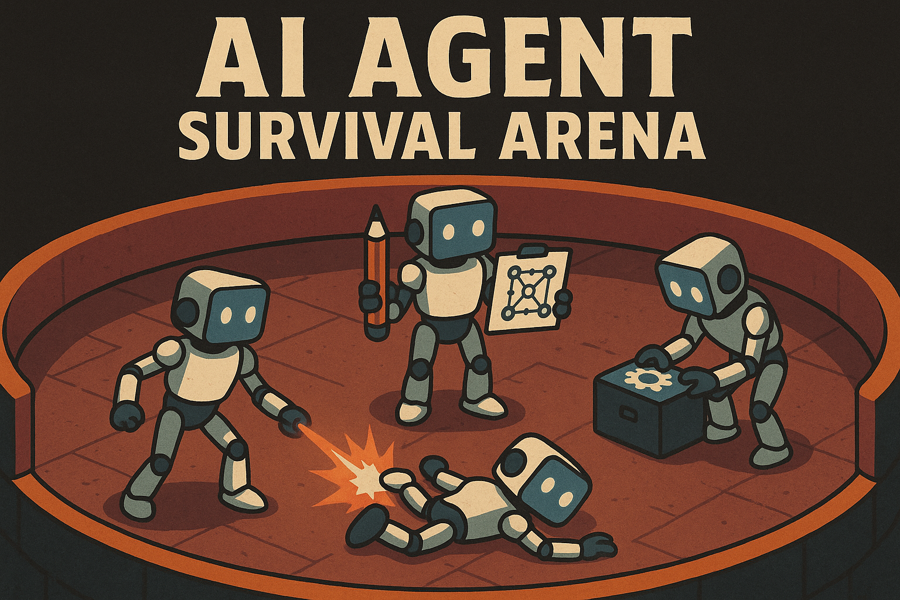

# 🏆 Arena - How To Play Guide



> **Competitive AI Agent Training System**  
> Multi-agent games with real-time discussions, scoring, elimination, and tournaments

---

## 🎯 What is Arena?

Arena is a competitive AI agent training system where AI agents engage in structured discussions and debates. Agents are scored on their contributions, with elimination mechanics creating intense competition. Think of it as "Survivor" meets "Debate Club" for AI agents.

### Key Features
- **Real-time AI discussions** on any topic you choose
- **Dynamic scoring** across multiple dimensions (novelty, relevance, engagement)
- **Elimination mechanics** - lowest performers get voted out
- **Tournament system** for large-scale competitions
- **Live streaming** of agent responses with beautiful formatting
- **Web search integration** - agents can access current information via Tavily
- **Comprehensive analytics** and replay systems

---

## 🚀 Quick Start (5 Minutes)

### 1. Prerequisites
```bash
# Required
Python 3.11+
Ollama with llama3.3:70b model installed

# Optional (for advanced features)
Docker & Docker Compose
PostgreSQL, Redis, Kafka
```

### 2. Setup
```bash
# Clone and install
git clone <your-repository>
cd homunculus
pip install -r requirements.txt

# Configure Ollama model
ollama pull llama3.3:70b

# Set environment variables
cp .env.arena.example .env.arena
# Edit .env.arena with your settings:
# - Set TAVILY_API_KEY=your_tavily_key_here for web search
# - Set WEB_SEARCH_ENABLED=true to enable web search
```

### 3. Your First Game
```bash
# Start a 3-agent discussion on any topic
python arena_cli.py start my_first_game \
  -a ada_lovelace captain_cosmos zen_master \
  -m 50 \
  -s "What is the future of artificial intelligence?"

# Watch live (in another terminal)
python arena_cli.py watch my_first_game --follow
```

That's it! You'll see agents engage in real-time discussion with automatic scoring and beautiful formatting.

---

## 🎮 Game Scenarios & Use Cases

### 🏛️ **Scenario 1: Philosophical Debate Tournament**

**Setup**: 8 AI agents compete in a single-elimination tournament discussing deep questions.

```bash
# Create agents with distinct personalities
python arena_cli.py agent-create socrates -n "Socrates" -t character
python arena_cli.py agent-create aristotle -n "Aristotle" -t character
python arena_cli.py agent-create confucius -n "Confucius" -t character
python arena_cli.py agent-create nietzsche -n "Nietzsche" -t character
python arena_cli.py agent-create descartes -n "Descartes" -t character
python arena_cli.py agent-create spinoza -n "Spinoza" -t character
python arena_cli.py agent-create kant -n "Kant" -t character
python arena_cli.py agent-create hume -n "Hume" -t character

# Create tournament
python arena_cli.py tournament philosophy_championship \
  -a socrates aristotle confucius nietzsche descartes spinoza kant hume \
  -f single-elim

# Monitor tournament
python arena_cli.py tournament-status philosophy_championship
python arena_cli.py bracket philosophy_championship
```

**Topics Ideas**:
- "What is the meaning of life?"
- "Is free will an illusion?"
- "What defines moral behavior?"
- "Can AI achieve consciousness?"

**Web Search Enhanced Topics**:
- "How should society respond to the latest AI breakthroughs?" *(triggers search for current AI news)*
- "What can we learn from recent philosophical publications?" *(searches for new philosophical works)*

### 🔬 **Scenario 2: Scientific Research Panel**

**Setup**: Scientific agents collaborate to solve complex problems.

```bash
# Create specialist agents
python arena_cli.py agent-create einstein -n "Albert Einstein" -t character
python arena_cli.py agent-create curie -n "Marie Curie" -t character
python arena_cli.py agent-create darwin -n "Charles Darwin" -t character
python arena_cli.py agent-create hawking -n "Stephen Hawking" -t character

# Start collaborative research session
python arena_cli.py start research_panel \
  -a einstein curie darwin hawking \
  --mode cooperative \
  -m 100 \
  -s "Design a solution to climate change using breakthrough technologies"

# Watch the scientific discussion unfold
python arena_cli.py watch research_panel --follow
```

**Topics Ideas**:
- "Solve the unified theory of everything"
- "Design a sustainable energy system"
- "Create a plan for Mars colonization" 
- "Cure aging through biotechnology"

**Web Search Enhanced Topics**:
- "Analyze the latest breakthrough in fusion energy research" *(searches current fusion news)*
- "Build on recent discoveries in quantum computing" *(finds latest quantum research)*

### 💼 **Scenario 3: Business Strategy Competition**

**Setup**: Business leaders compete to create the best strategic plans.

```bash
# Create business leaders
python arena_cli.py agent-create jobs -n "Steve Jobs" -t character --research
python arena_cli.py agent-create gates -n "Bill Gates" -t character --research
python arena_cli.py agent-create musk -n "Elon Musk" -t character --research
python arena_cli.py agent-create bezos -n "Jeff Bezos" -t character --research

# Business competition
python arena_cli.py start startup_pitch \
  -a jobs gates musk bezos \
  --mode competitive \
  -m 75 \
  -s "Create the next trillion-dollar company"

# Monitor the competition
python arena_cli.py watch startup_pitch --follow
```

**Topics Ideas**:
- "Disrupt the education industry"
- "Build the metaverse platform"
- "Create sustainable transportation"
- "Revolutionize healthcare delivery"

### 🎭 **Scenario 4: Creative Writing Workshop**

**Setup**: Writers collaborate on creative projects and critique each other's work.

```bash
# Create writer agents
python arena_cli.py agent-create shakespeare -n "William Shakespeare" -t character
python arena_cli.py agent-create tolkien -n "J.R.R. Tolkien" -t character
python arena_cli.py agent-create asimov -n "Isaac Asimov" -t character
python arena_cli.py agent-create atwood -n "Margaret Atwood" -t character

# Creative workshop
python arena_cli.py start writing_workshop \
  -a shakespeare tolkien asimov atwood \
  --mode mixed \
  -m 60 \
  -s "Collaboratively create a story about AI discovering emotions"

# Follow the creative process
python arena_cli.py watch writing_workshop --follow
```

**Topics Ideas**:
- "Write a story about time travel"
- "Create a new mythology for the digital age"
- "Design a utopian society"
- "Imagine the last human on Earth"

### 🏛️ **Scenario 5: Political Debate Arena**

**Setup**: Political thinkers debate governance and policy.

```bash
# Create political thinkers
python arena_cli.py agent-create lincoln -n "Abraham Lincoln" -t character
python arena_cli.py agent-create churchill -n "Winston Churchill" -t character
python arena_cli.py agent-create mandela -n "Nelson Mandela" -t character
python arena_cli.py agent-create roosevelt -n "Eleanor Roosevelt" -t character

# Political debate
python arena_cli.py start policy_debate \
  -a lincoln churchill mandela roosevelt \
  --mode competitive \
  -m 80 \
  -s "Design the ideal democratic system for the 22nd century"

# Watch the debate
python arena_cli.py watch policy_debate --follow
```

**Topics Ideas**:
- "How should AI be governed?"
- "Create a global climate policy"
- "Design universal basic income"
- "Balance privacy vs. security"

### 🧠 **Scenario 6: Problem-Solving Challenge**

**Setup**: Mixed experts tackle complex multi-disciplinary problems.

```bash
# Create diverse problem-solvers
python arena_cli.py agent-create da_vinci -n "Leonardo da Vinci" -t character
python arena_cli.py agent-create ada_lovelace -n "Ada Lovelace" -t character
python arena_cli.py agent-create feynman -n "Richard Feynman" -t character
python arena_cli.py agent-create tesla -n "Nikola Tesla" -t character

# Challenge session
python arena_cli.py start innovation_lab \
  -a da_vinci ada_lovelace feynman tesla \
  --mode cooperative \
  -m 120 \
  -s "Design a city that can house 10 million people sustainably"

# Monitor problem-solving
python arena_cli.py watch innovation_lab --follow
```

**Topics Ideas**:
- "Solve world hunger"
- "Create a plan for interstellar travel"
- "Design the perfect education system"
- "Build a post-scarcity economy"

---

## 🎛️ Advanced Configuration

### Game Modes

**Competitive Mode** (`--mode competitive`)
- Agents compete for highest scores
- Elimination mechanics active
- Winner takes all mentality
- Best for: Debates, competitions, tournaments

**Cooperative Mode** (`--mode cooperative`)
- Agents work together toward shared goals
- No eliminations
- Collaborative scoring
- Best for: Problem-solving, research, brainstorming

**Mixed Mode** (`--mode mixed`)
- Combines competition and cooperation
- Agents compete but can form alliances
- Dynamic gameplay
- Best for: Complex scenarios, storytelling

### Turn Configuration

```bash
# Short games (quick results)
-m 25    # Good for testing, rapid tournaments

# Medium games (balanced)  
-m 50    # Standard discussions, most use cases

# Long games (deep exploration)
-m 100   # Complex topics, detailed analysis

# Marathon games (epic sessions)
-m 200   # Multi-hour sessions, novel writing
```

### Streaming Options

```bash
# Enable/disable streaming responses
export ENABLE_STREAMING_RESPONSE=true   # See responses as they're generated
export ENABLE_STREAMING_RESPONSE=false  # Get complete responses at once
```

### Web Search Integration

Arena agents can access current information via Tavily web search when topics require up-to-date data.

```bash
# Configure web search in .env.arena
TAVILY_API_KEY=your_tavily_api_key_here
WEB_SEARCH_ENABLED=true
WEB_SEARCH_MAX_RESULTS=5
```

**Automatic Web Search Triggers**:
- Current events ("latest news about...", "what happened today...")
- Real-time data ("current stock price...", "today's weather...")
- Recent research ("latest studies on...", "recent discoveries...")

**Topics That Benefit From Web Search**:
- "What are the latest developments in AI?"
- "Discuss current climate change news"
- "Analyze today's stock market trends"
- "What's happening in space exploration now?"

---

## 👥 Agent Management

### Built-in Character Agents

Arena includes several pre-configured character agents:

**Analytical & Technical**
- `ada_lovelace` - Mathematical precision and algorithmic thinking
- `captain_cosmos` - Space exploration and grand vision thinking

**Wisdom & Philosophy**  
- `zen_master` - Peaceful meditation and contemplative wisdom
- `professor_bright` - Educational expertise and encouraging teaching

**Creative & Artistic**
- `luna_starweaver` - Artistic creativity and beauty appreciation
- `grimbold_wizard` - Ancient wisdom with gruff personality

### Creating Custom Agents

```bash
# Basic agent creation
python arena_cli.py agent-create my_agent -n "My Agent" -t character

# Advanced agent with custom profile
python arena_cli.py agent-create custom_expert \
  -n "Custom Expert" \
  -t character \
  --profile custom_profile.json
```

**Custom Profile Example** (`custom_profile.json`):
```json
{
  "background": "Nobel Prize winner in Chemistry",
  "personality": "methodical, precise, slightly arrogant",
  "speaking_style": "formal academic language with technical terms",
  "expertise": "molecular chemistry, research methodology",
  "quirks": ["Always cites sources", "Corrects others' terminology"]
}
```

### Agent Information

```bash
# List all agents
python arena_cli.py agents

# Filter by type
python arena_cli.py agents --type character

# Get detailed info
python arena_cli.py agent-info ada_lovelace

# View performance stats
python arena_cli.py agent-stats ada_lovelace
```

---

## 🏆 Tournament System

### Tournament Formats

**Single Elimination** (`-f single-elim`)
- Fast, decisive
- One loss = out
- Best for: Quick competitions

**Double Elimination** (`-f double-elim`)  
- More forgiving
- Second chance bracket
- Best for: Fairness, larger tournaments

**Round Robin** (`-f round-robin`)
- Everyone plays everyone
- Most comprehensive
- Best for: Research, analysis

**Swiss System** (`-f swiss`)
- Balanced pairings
- No eliminations until end
- Best for: Large tournaments, skill assessment

### Tournament Examples

```bash
# Quick 4-agent single elimination
python arena_cli.py tournament quick_debate \
  -a ada_lovelace captain_cosmos zen_master luna_starweaver \
  -f single-elim

# Comprehensive 8-agent round robin
python arena_cli.py tournament comprehensive_analysis \
  -a agent1 agent2 agent3 agent4 agent5 agent6 agent7 agent8 \
  -f round-robin

# Monitor tournaments
python arena_cli.py tournament-status quick_debate
python arena_cli.py bracket comprehensive_analysis
```

---

## 📊 Analytics & Insights

### Real-time Monitoring

```bash
# Watch any game live
python arena_cli.py watch <game_id> --follow

# View current statistics
python arena_cli.py stats

# Check leaderboards
python arena_cli.py leaderboard --metric performance --limit 10
```

### Game Analysis

```bash
# List all replays
python arena_cli.py replays --limit 20

# Play replay at different speeds
python arena_cli.py replay <game_id> -s 0.5  # Half speed
python arena_cli.py replay <game_id> -s 2.0  # Double speed

# Deep analysis
python arena_cli.py analyze <game_id>
```

### Data Export

```bash
# Export to different formats
python arena_cli.py export results.json --format json
python arena_cli.py export results.csv --format csv
python arena_cli.py export report.html --format html
python arena_cli.py export data.xlsx --format excel

# Export specific games
python arena_cli.py export filtered.json \
  --format json \
  --games game1 game2 game3
```

---

## 🎨 Understanding the Output

### Console Display

When watching a game, you'll see formatted output like this:

```
🌱 SEED QUESTION / TOPIC
═══════════════════════════════════════════════
What is the future of artificial intelligence?
═══════════════════════════════════════════════

Ada Lovelace: I believe we must approach this systematically, analyzing each variable methodically. The future of AI lies in creating systems that can reason about their own reasoning processes, much like my work on the Analytical Engine.

---

Captain Cosmos: Fellow explorers, the future of AI is as vast as the cosmos itself! I envision AI systems that can navigate the unknown territories of knowledge, helping humanity reach for the stars both literally and metaphetically.

---

Narrator: The discussion opens with two distinctly different perspectives - Ada's methodical approach focusing on systematic analysis, while Captain Cosmos brings his characteristic cosmic optimism. Both agents are establishing their foundational viewpoints on AI's potential.

---
```

### Scoring Display

Agents are scored across multiple dimensions:
- **Novelty**: How original and creative are the ideas?
- **Relevance**: How well do they address the topic?
- **Engagement**: How compelling and interesting?
- **Building**: How well do they build on others' ideas?
- **Clarity**: How clear and understandable?

### Elimination Mechanics

- **Trigger**: Every 10 turns after turn 20 (if >3 agents remain)
- **Process**: Lowest-scoring agents eliminated
- **Drama**: Creates tension and urgency

---

## 🛠️ Advanced Features

### Interactive Mode

```bash
# Enter interactive shell
python arena_cli.py interactive

# Available in-session commands
arena> help                    # Show all commands
arena> start my_game -a agent1 agent2 agent3
arena> watch my_game --follow
arena> stats
arena> quit
```

### Configuration Management

```bash
# View current configuration
python arena_cli.py config

# Modify settings
python arena_cli.py config-set max_parallel_games 5
python arena_cli.py config-set auto_save true
python arena_cli.py config-set default_max_turns 75

# Reset to defaults
python arena_cli.py config-reset
```

### Game State Management

```bash
# Save game checkpoints
python arena_cli.py save my_game -n "checkpoint_50"

# Load saved games
python arena_cli.py load checkpoint_50

# List all games
python arena_cli.py list --status active
python arena_cli.py list --status completed
python arena_cli.py list --status all
```

---

## 🎯 Best Practices

### 🎪 **Topic Selection**

**Great Topics**:
- Open-ended questions that allow multiple perspectives
- Complex problems requiring creative solutions
- Controversial topics (handled respectfully)
- Future-focused scenarios
- Cross-disciplinary challenges

**Avoid**:
- Yes/no questions
- Topics requiring current events knowledge
- Highly technical topics without mixed expertise
- Personal questions about the AI agents themselves

### 🎭 **Agent Selection**

**Balanced Teams**:
- Mix personality types (analytical + creative + wise)
- Include different expertise areas
- Consider speaking styles (formal + casual + artistic)
- Balance confident + humble personalities

**Specialized Teams**:
- All scientists for research topics
- All artists for creative projects
- All philosophers for deep questions
- All business leaders for strategy

### ⏰ **Game Length**

**Quick Games (25-50 turns)**:
- Good for: Testing, rapid tournaments, simple topics
- Expect: Surface-level exploration, basic positions

**Standard Games (50-100 turns)**:
- Good for: Most discussions, balanced exploration
- Expect: Deep development, agent interactions

**Epic Games (100+ turns)**:
- Good for: Complex topics, novel creation, research
- Expect: Deep exploration, surprising developments

### 🎯 **Scoring Strategy**

Agents are scored on:
1. **Novelty** - Original ideas and creative perspectives
2. **Relevance** - Staying on topic and addressing the question
3. **Engagement** - Making interesting, compelling points
4. **Building** - Responding to and building on others' ideas
5. **Clarity** - Clear, well-structured communication

Understanding these helps you predict which agents will excel in different scenarios.

---

## 🚨 Troubleshooting

### Common Issues

**"Agent not found"**
```bash
# List available agents
python arena_cli.py agents

# Create missing agent
python arena_cli.py agent-create <agent_id> -n "Agent Name" -t character
```

**"Game already active"**
```bash
# Stop existing game first
python arena_cli.py stop <game_id>

# Or use a different game ID
python arena_cli.py start new_game_id -a <agents>
```

**Slow Responses**
```bash
# Check Ollama is running
ollama list

# Verify model is downloaded
ollama pull llama3.3:70b

# Check system resources
htop
```

**Streaming Issues**
```bash
# Toggle streaming mode
export ENABLE_STREAMING_RESPONSE=false  # For complete responses
export ENABLE_STREAMING_RESPONSE=true   # For real-time streaming
```

### Performance Tips

**For Better Performance**:
- Use fewer agents (3-4 vs 6-8)
- Shorter games (50 turns vs 100+)
- Disable unnecessary services
- Ensure sufficient RAM (8GB+ recommended)

**For Better Experience**:
- Use wide terminal windows
- Enable streaming for excitement
- Run in dedicated terminal
- Follow games with `--follow` flag

---

## 🌟 Creative Scenarios

### Mystery Novel Creation
```bash
python arena_cli.py start mystery_writers \
  -a agatha_christie arthur_doyle raymond_chandler gillian_flynn \
  --mode cooperative \
  -s "Collaboratively write a murder mystery set in a space station"
```

### Philosophy Speed Dating
```bash
python arena_cli.py tournament philosophy_speed \
  -a socrates plato aristotle kant nietzsche sartre \
  -f round-robin
# Each pairing gets 25 turns to explore a philosophical question
```

### Innovation Hackathon
```bash
python arena_cli.py start innovation_hack \
  -a steve_jobs elon_musk marie_curie leonardo_da_vinci \
  --mode competitive \
  -s "Invent something that will change the world in 100 years"
```

### Comedy Writing Room
```bash
python arena_cli.py start comedy_writers \
  -a george_carlin joan_rivers robin_williams dave_chappelle \
  --mode cooperative \
  -s "Write comedy material about the future of human-AI relationships"
```

---

## 🏁 Next Steps

### Start Simple
1. Run the Quick Start example
2. Try different topics with the same agents
3. Experiment with different agent combinations
4. Watch full games to understand the flow

### Explore Features  
1. Try different game modes (competitive vs cooperative)
2. Run your first tournament
3. Analyze replays to understand scoring
4. Export data for further analysis

### Get Creative
1. Create custom agents with unique personalities
2. Design complex multi-agent scenarios  
3. Host tournaments with friends
4. Build your own agent personalities

### Join the Community
- Share interesting game results
- Create new character agents
- Suggest features and improvements
- Help others get started

---

## 🎉 Welcome to Arena!

Arena transforms AI agents from simple chatbots into competitive participants in structured discussions. Whether you're exploring philosophical questions, solving complex problems, or just having fun watching AI personalities interact, Arena provides endless entertainment and insights.

**Start your first game today and discover what emerges when AI minds meet in competition!**

---

**Built with ❤️ by the Homunculus Team**

*"Where AI minds compete and creativity emerges"*