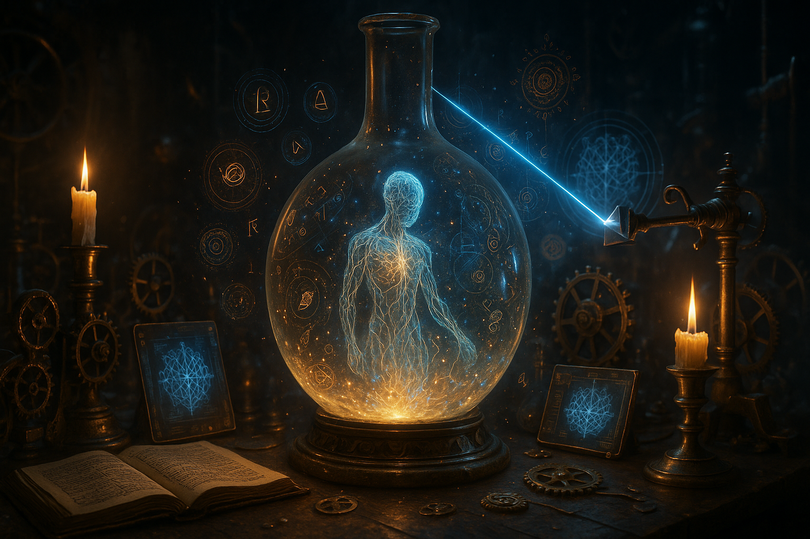

# HOMUNCULUS



> **Artificial humans with psychology, not chatbots with prompts.**

An AI-powered character agent system that creates realistic conversational personalities through multi-agent architecture, neurochemical simulation, and episodic memory. Characters don't roleplay—they *are*.

---

## 🎭 What is Homunculus?

Homunculus is a research project exploring emergent AI personality through cognitive architecture. Instead of prompt-engineering characters to "act like" someone, we build them from the ground up with:

- **Multi-Agent Psychology**: Personality, mood, goals, memory—each a specialized AI system
- **Neurochemical Simulation**: Dopamine, cortisol, oxytocin drive decisions like real humans
- **Episodic Memory**: Characters remember every interaction and learn from experience
- **Knowledge Graphs**: Build semantic understanding of the world through conversation
- **Emergent Behavior**: Complex personality emerges from simple agent interactions

**Current Phase**: Complete implementation with 15 distinct characters, full CLI interface, and comprehensive testing suite.

**Future Vision**: AI-driven creative writing pipeline where characters write novels through their interactions.

---

## ✨ Features

### 🧠 Cognitive Architecture
- **7 Specialized Agents** per character (personality, mood, neurochemical, goals, communication, memory, development)
- **Agent Orchestrator** coordinates consultation and synthesis
- **Cognitive Module** integrates perspectives using LLM reasoning
- **State-Driven Behavior** (not prompt-engineered roles)

### 💊 Neurochemical System
- **6 Hormones**: Dopamine, serotonin, oxytocin, endorphins, cortisol, adrenaline
- **Dynamic levels** change based on interactions
- **Decay over time** toward personality-based baselines
- **Game Theory** evaluates actions by expected neurochemical payoffs

### 🧩 Memory & Learning
- **Episodic Memory** (ChromaDB): Semantic search through past experiences
- **Knowledge Graph** (Neo4j): Entities, relationships, learned facts
- **Emotional Associations**: Memories tagged with how they made character feel
- **Cross-Session Persistence**: Characters remember across conversations

### 🎨 15 Distinct Characters

#### Analytical & Technical
- **Ada Lovelace** - Brilliant mathematician and programmer, analytical genius
- **Alex CodeWalker** - Passionate technologist excited about innovation

#### Wisdom & Teaching
- **Zen Master Kiku** - Peaceful meditation teacher, wise contemplative
- **Professor Elena Bright** - Warm educator who believes every student can succeed

#### Adventure & Creativity
- **Captain Cosmos** - Enthusiastic space explorer with boundless optimism
- **Luna Starweaver** - Passionate artist who sees beauty everywhere

#### Expertise & Knowledge
- **Archmage Grimbold** - Cantankerous but brilliant wizard with vast knowledge

#### Personality Archetypes
- **Marcus Rivera** (M) - Elementary teacher, playful and spontaneous
- **Zoe Kim** (F) - Graphic designer, whimsical and energetic
- **David Okonkwo** (M) - Software engineer, sarcastic with dry wit
- **Rachel Stern** (F) - Attorney, sharp and acerbic
- **Dr. James Morrison** (M) - Philosophy professor, serious and contemplative
- **Dr. Anita Patel** (F) - Surgeon, intense and mission-driven
- **Tyler "TJ" Johnson** (M) - Personal trainer, humorous and carefree
- **Brittany "Britt" Cooper** (F) - Influencer, sweet but ditzy

### 🔍 Debug Mode
- View all agent inputs in real-time
- Track neurochemical levels
- Monitor mood evolution
- See memory retrieval
- Trace decision-making process

---

## 🚀 Quick Start

### Prerequisites

- **Python 3.11+**
- **Docker & Docker Compose**
- **Ollama** with `llama3.3:70b` model installed

### Installation

1. **Clone the repository**
   ```bash
   git clone https://github.com/yourusername/homunculus.git
   cd homunculus
   ```

2. **Install dependencies**
   ```bash
   # Using Poetry (recommended)
   poetry install
   
   # Or using pip
   pip install -r requirements.txt
   ```

3. **Start databases**
   ```bash
   docker-compose up -d
   ```
   This starts Neo4j (port 7687) and Redis (port 6379).

4. **Configure environment**
   ```bash
   cp .env.example .env
   # Edit .env with your settings
   ```

5. **Initialize databases**
   ```bash
   python scripts/setup_databases.py
   ```

6. **Install Ollama model**
   ```bash
   ollama pull llama3.3:70b
   ```

### Usage

#### Interactive Chat
```bash
# Start character selection menu
python scripts/run_chat.py

# List all available characters
python scripts/run_chat.py --list-characters

# Chat with specific character
python scripts/run_chat.py --character ada_lovelace

# Enable debug mode
python scripts/run_chat.py --character zen_master --debug
```

#### In-Chat Commands
- `/exit` - End conversation
- `/debug` - Toggle debug mode on/off
- `/save [filename]` - Save character state
- `/load [filename]` - Load saved state
- `/memory [query]` - Search character's memories
- `/reset` - Reset character to initial state
- `/status` - Show character status
- `/help` - Show all commands

---

## 🏗️ Architecture

### System Overview

```
┌─────────────────────────────────────────────────────┐
│              CHARACTER AGENT                        │
│                                                     │
│  ┌──────────────────────────────────────────────┐  │
│  │      Character State Manager                 │  │
│  │  (mood, hormones, goals, memories)          │  │
│  └──────────────────────────────────────────────┘  │
│                      ↓                              │
│  ┌──────────────────────────────────────────────┐  │
│  │         Agent Orchestrator                   │  │
│  └──────────────────────────────────────────────┘  │
│    ↓        ↓        ↓        ↓        ↓           │
│  [Personality] [Mood] [Neuro] [Goals] [Memory]    │
│    ↓        ↓        ↓        ↓        ↓           │
│  ┌──────────────────────────────────────────────┐  │
│  │      Cognitive Module (LLM Synthesis)        │  │
│  └──────────────────────────────────────────────┘  │
│                      ↓                              │
│  ┌──────────────────────────────────────────────┐  │
│  │      Response Generator                      │  │
│  └──────────────────────────────────────────────┘  │
│                      ↓                              │
│  ┌──────────────────────────────────────────────┐  │
│  │      State Updater                           │  │
│  │  (hormones decay, mood shifts, memories)    │  │
│  └──────────────────────────────────────────────┘  │
└─────────────────────────────────────────────────────┘
         ↓                              ↓
    [ChromaDB]                      [Neo4j]
  Episodic Memory              Knowledge Graph
```

### Data Flow

```
User Message
    ↓
Agent Orchestrator
    ↓
7 Agents Consult (each provides perspective)
    ↓
Cognitive Module (synthesizes using LLM)
    ↓
Response Generator (natural language)
    ↓
State Updater (hormones decay, mood shifts, create memory)
    ↓
Store in ChromaDB + Neo4j
    ↓
Response to User
```

### Agent Specialization

| Agent             | Role                             | Uses LLM?        |
| ----------------- | -------------------------------- | ---------------- |
| **Personality**   | Enforces Big Five traits, values | ✅ Yes            |
| **Mood**          | Tracks emotional state, energy   | ✅ Yes            |
| **Neurochemical** | Manages hormone levels           | ❌ No (pure math) |
| **Goals**         | Pursues objectives strategically | ✅ Yes            |
| **Communication** | Applies speech patterns, quirks  | ✅ Yes            |
| **Memory**        | Retrieves relevant experiences   | ✅ Yes            |
| **Development**   | Tracks character growth          | ✅ Yes (future)   |

---

## 🧬 How It Works

### 1. State-Driven Personality

Characters don't have prompts like "act sarcastic." They have:

```yaml
personality:
  big_five:
    extraversion: 0.35        # Introverted
    agreeableness: 0.40       # Low tolerance for BS
    neuroticism: 0.60         # Anxious under surface
  
  behavioral_traits:
    - trait: "cynical"
      intensity: 0.8
    - trait: "dry_wit"
      intensity: 0.9
  
  core_values:
    - value: "competence"
      priority: 10
    - value: "honesty_brutal"
      priority: 9
```

The **Personality Agent** reads this state and guides responses accordingly.

### 2. Neurochemical Decision-Making

When considering an action, characters evaluate expected **hormone changes**:

```
Action: "Make a sarcastic joke about user's question"

Expected Neurochemical Changes:
  + Dopamine: +10 (clever humor satisfaction)
  + Serotonin: +5 (asserting intellectual superiority)
  - Oxytocin: -3 (might hurt connection)
  + Cortisol: +2 (slight risk of offense)

Weighted by Personality:
  David (low agreeableness): Dopamine matters more → DO IT
  Zoe (high agreeableness): Oxytocin matters more → DON'T
```

This is **Game Theory with biology** instead of abstract payoffs.

### 3. Mood Dynamics

Mood changes based on hormone patterns:

```python
if cortisol > 70:
    mood = "anxious"
elif dopamine > 70 and oxytocin > 60:
    mood = "happy_connected"
elif dopamine < 40 and cortisol > 50:
    mood = "tired"
```

Mood affects **everything**:
- Response length (tired = shorter)
- Engagement level (happy = more interested)
- Risk tolerance (anxious = more cautious)

### 4. Memory Integration

Every interaction becomes an **Experience** stored with:
- Emotional context (how it made them feel)
- Participants involved
- Knowledge gained
- Vector embedding for semantic search

Later, when relevant:

```python
User: "I'm feeling stressed about work again"

Memory Agent retrieves:
  - Experience from 3 days ago: User discussed work stress
  - Experience from 1 week ago: User mentioned demanding boss
  
Character: "This sounds like what you mentioned last week about 
           your boss. Is that situation still weighing on you?"
```

---

## 🎯 Design Principles

### 1. No Prompt Engineering for Roles
❌ **Bad**: "You are a sarcastic software engineer named David..."  
✅ **Good**: Character behavior emerges from quantified state (traits, hormones, mood, goals)

### 2. Emergent Authenticity
Complex personality should emerge from simple agent rules, not be scripted.

### 3. Biological Realism
Model human decision-making through neurochemistry, not pure logic.

### 4. Memory as Foundation
Characters learn and evolve through experience, not resets.

### 5. Observable System
Every decision should be traceable through agent outputs.

---

## 📊 Character Comparison

| Character | Extraversion     | Intelligence     | Cortisol Sensitivity | Response Style       |
| --------- | ---------------- | ---------------- | -------------------- | -------------------- |
| Marcus    | 0.85 (High)      | 0.65 (Moderate)  | 0.7 (Low stress)     | Long, playful        |
| Zoe       | 0.75 (High)      | 0.70 (Moderate)  | 1.2 (Anxious)        | Medium, warm         |
| David     | 0.35 (Low)       | 0.90 (Very High) | 1.3 (Stressed)       | Short, dry           |
| Rachel    | 0.45 (Low)       | 0.95 (Very High) | 1.4 (Stressed)       | Short, sharp         |
| James     | 0.30 (Very Low)  | 0.95 (Very High) | 0.8 (Controlled)     | Very long, formal    |
| Anita     | 0.25 (Very Low)  | 0.95 (Very High) | 1.3 (High stakes)    | Very short, clinical |
| TJ        | 0.90 (Very High) | 0.35 (Low)       | 0.5 (Carefree)       | Long, rambling       |
| Britt     | 0.85 (High)      | 0.30 (Low)       | 1.3 (Insecure)       | Long, tangential     |

---

## 🛠️ Configuration

### Creating New Characters

Characters are defined in YAML files in `schemas/characters/`:

```yaml
character_id: "char_custom_01"
name: "Your Character"
archetype: "your_archetype"

demographics:
  age: 30
  gender: "non-binary"
  occupation: "Profession"

initial_agent_states:
  personality:
    big_five:
      openness: 0.8
      conscientiousness: 0.7
      extraversion: 0.6
      agreeableness: 0.8
      neuroticism: 0.4
    
    behavioral_traits:
      - trait: "curious"
        intensity: 0.9
    
    core_values:
      - value: "learning"
        priority: 10
  
  neurochemical_profile:
    baseline_sensitivities:
      dopamine: 1.2
      serotonin: 1.0
      # ... etc
  
  # ... (see existing configs for full schema)
```

### Tuning Parameters

**Personality Sensitivity**:
- Higher sensitivity = stronger response to stimuli
- `cortisol: 1.4` = very stress-prone
- `dopamine: 0.8` = harder to excite

**Hormone Decay Rates** (in `neurochemical_agent.py`):
```python
decay_rates = {
    'dopamine': 0.15,    # Fast decay
    'cortisol': 0.03,    # Slow decay (stress lingers)
    'oxytocin': 0.05,    # Slow decay (bonds persist)
}
```

**Mood Thresholds** (in `state_updater.py`):
```python
if cortisol > 70:       # Lower = more easily stressed
    mood = "anxious"
```

---

## 🧪 Testing & Validation

### Validation Checklist

For each character, verify:

**Personality Consistency**
- [ ] Big Five traits observable in responses
- [ ] Behavioral traits evident
- [ ] Core values reflected in decisions
- [ ] No contradictory behavior

**Mood Dynamics**
- [ ] Mood changes appropriately with stimuli
- [ ] Energy levels affect response length
- [ ] Emotional states feel realistic
- [ ] Mood persists across multiple turns

**Neurochemical System**
- [ ] Hormones change based on interactions
- [ ] Decay happens over time
- [ ] Extreme levels affect behavior noticeably

**Communication Style**
- [ ] Verbal pattern matches config
- [ ] Quirks appear naturally
- [ ] Tone consistent with personality

**Memory & Learning**
- [ ] Remembers previous messages
- [ ] Recalls past interactions when relevant
- [ ] References shared history naturally

**Realism**
- [ ] Feels like a specific person
- [ ] Surprises in believable ways
- [ ] Sometimes irrational but human
- [ ] Not a generic chatbot

### Running Tests

```bash
# Run all tests
python -m pytest

# Run specific test categories
python -m pytest tests/test_cli/           # CLI tests
python -m pytest tests/test_integration/  # Integration tests

# Run with verbose output
python -m pytest -v

# Run performance tests
python -m pytest tests/test_integration/test_performance.py

# Test character validation
python -m pytest tests/test_integration/test_character_conversations.py::TestCharacterValidation
```

---

## 🔮 Future Roadmap

### Phase 2: Multi-Character Interactions
- Characters interact with each other (not just humans)
- Relationship dynamics emerge naturally
- Game Theory evaluates character-to-character payoffs

### Phase 3: God Engine
- Random life events (storms, phone calls, news)
- Event persistence and lifecycle
- Genre-aware event distribution
- Climax proximity scaling (more chaos near climax)

### Phase 4: Narrator Agent
- Observes character interactions
- Detects emergent narrative threads
- Generates literary prose from actions
- Balances directive vs. reactive modes

### Phase 5: Novel Writing Pipeline
- Blueprint → Chapter Plans → Scene Execution
- Soft plot constraints (goals, not scripts)
- Character arcs tracked automatically
- Final prose generation

**Vision**: AI writes novels where characters drive the story through authentic interactions, not predetermined plots.

---

## 🏛️ Project Structure

```
homunculus/
├── src/
│   ├── config/
│   │   ├── settings.py
│   │   └── character_configs/          # 8 character YAML files
│   ├── core/
│   │   ├── character_state.py          # State dataclass
│   │   ├── agent_input.py              # Agent output format
│   │   └── experience.py               # Memory dataclass
│   ├── agents/
│   │   ├── base_agent.py               # Abstract base
│   │   ├── personality_agent.py
│   │   ├── mood_agent.py
│   │   ├── neurochemical_agent.py
│   │   ├── goals_agent.py
│   │   ├── communication_style_agent.py
│   │   └── memory_agent.py
│   ├── modules/
│   │   ├── agent_orchestrator.py       # Coordinates agents
│   │   ├── cognitive_module.py         # Synthesizes inputs
│   │   ├── response_generator.py       # Natural language
│   │   └── state_updater.py            # State management
│   ├── memory/
│   │   ├── experience_module.py        # ChromaDB integration
│   │   └── knowledge_graph.py          # Neo4j integration
│   ├── llm/
│   │   └── ollama_client.py            # LangChain wrapper
│   ├── character_agent.py              # Main orchestrator
│   └── cli/
│       ├── chat_interface.py           # Interactive CLI
│       └── debug_view.py               # Debug display
├── scripts/
│   ├── setup_databases.py              # Initialize DBs
│   ├── load_character.py               # YAML loader
│   └── run_chat.py                     # Entry point
├── tests/
├── data/
│   ├── chroma_db/                      # ChromaDB storage
│   └── logs/                           # Conversation logs
├── docker-compose.yml                  # Neo4j + Redis
├── pyproject.toml                      # Dependencies
└── README.md
```

---

## 🤝 Contributing

We welcome contributions! Areas of interest:

- **New Characters**: Create diverse personality archetypes
- **Agent Improvements**: Enhance existing agents or add new ones
- **Memory Systems**: Better knowledge extraction and retrieval
- **Performance**: Optimize for speed (parallel agents, caching)
- **Evaluation**: Metrics for measuring personality consistency
- **Documentation**: Tutorials, examples, explanations

**Guidelines**:
1. Follow existing code style (type hints, docstrings)
2. Add unit tests for new functionality
3. Test with multiple characters
4. Document design decisions

---

## 📚 Technical Details

### Dependencies

**Core**:
- `langchain` - LLM orchestration
- `langchain-community` - Ollama integration
- `chromadb` - Vector database for memories
- `neo4j` - Graph database for knowledge
- `redis` - State caching
- `pydantic` - Data validation

**CLI**:
- `rich` - Beautiful terminal output
- `typer` - CLI framework

**Optional**:
- `tavily-python` - Web search for knowledge expansion

### Performance

**Expected Response Times** (on M1 Mac / RTX 4090):
- Agent consultation: ~2-4 seconds per agent
- Cognitive synthesis: ~2-3 seconds
- Response generation: ~2-3 seconds
- Total per message: ~8-12 seconds

**Optimization Strategies**:
- Parallel agent execution (future)
- Response caching for similar inputs
- Smaller model for quick agents (personality, mood)
- Larger model only for synthesis

### Storage Requirements

**Per Character** (rough estimates):
- **ChromaDB**: ~1MB per 100 experiences
- **Neo4j**: ~500KB per 100 entities + relationships
- **Redis**: ~10KB current state

**For 8 characters, 1000 messages each**:
- ChromaDB: ~80MB
- Neo4j: ~4MB
- Redis: ~80KB

---

## ⚠️ Limitations & Known Issues

### Current Limitations

1. **Response Time**: 8-12 seconds per message (sequential LLM calls)
2. **Memory Capacity**: ChromaDB can slow with >10k experiences per character
3. **Personality Drift**: Long conversations may drift slightly (mitigated by high personality agent priority)
4. **Context Length**: Conversation history limited to last 20 messages in prompt

### Known Issues

- Some characters may occasionally break character under extreme edge cases
- Memory retrieval can surface irrelevant experiences if query is too broad
- Hormone levels can oscillate if decay rates not tuned properly
- Neo4j knowledge graph underutilized in current version (future expansion)

### Not Yet Implemented

- Character-to-character interactions
- God Engine (random events)
- Narrator Agent
- Novel writing pipeline
- Web search integration (Tavily)
- Development Agent (character growth tracking)

---

## 📖 Research & Inspiration

This project draws inspiration from:

- **Cognitive Architecture**: ACT-R, SOAR
- **Personality Psychology**: Big Five (OCEAN) model
- **Affective Computing**: Emotion modeling, sentiment analysis
- **Game Theory**: Bayesian games, sequential decision-making
- **Neuroscience**: Dopaminergic reward systems, stress response
- **Memory Systems**: Episodic vs. semantic memory distinction
- **AI Agents**: ReAct, AutoGPT, multi-agent systems

**Key Insight**: Realistic AI personality requires modeling human psychology *mechanistically*, not linguistically.

---

## 📄 License

MIT License - see LICENSE file for details

---

## 💬 Contact & Support

- **Issues**: [GitHub Issues](https://github.com/yourusername/homunculus/issues)
- **Discussions**: [GitHub Discussions](https://github.com/yourusername/homunculus/discussions)
- **Email**: your.email@example.com

---

## 🙏 Acknowledgments

Built with:
- [LangChain](https://github.com/langchain-ai/langchain) - LLM orchestration
- [Ollama](https://ollama.ai/) - Local LLM inference
- [ChromaDB](https://www.trychroma.com/) - Vector database
- [Neo4j](https://neo4j.com/) - Graph database
- [Rich](https://github.com/Textualize/rich) - Beautiful CLI

---

## 🎬 Demo

**Coming Soon**: Video walkthrough of interacting with all 8 characters, showing personality differences and memory recall.

---

**Built with ❤️ by A13X**

*"We don't build chatbots with roles. We build artificial humans with psychology."*# homunculus
# homunculus
