# High-Level Component Design

## Character Component Architecture

### Character System
A character is a **composite entity** consisting of multiple specialized agents coordinated by a cognitive module.

```
CHARACTER
│
├── Identity Metadata
│   ├── Name
│   ├── Age, Gender
│   ├── Background (profession, education, family)
│   └── Role in Story (protagonist, antagonist, supporting)
│
├── Agent Layer (Specialized Intelligence Units)
│   │
│   ├── Personality Agent
│   │   ├── Traits (Big Five: openness, conscientiousness, extraversion, agreeableness, neuroticism)
│   │   ├── Behavioral patterns (risk-taking, conflict-avoidance, spontaneity)
│   │   └── Core values (honesty, loyalty, ambition, compassion)
│   │
│   ├── Specialty Agent (Domain Knowledge)
│   │   ├── Professional expertise (medical, legal, technical, artistic)
│   │   ├── Domain-specific reasoning patterns
│   │   └── Vocabulary and communication patterns for this domain
│   │
│   ├── Skill Level Agent (Cognitive Capabilities)
│   │   ├── Intelligence level (analytical, creative, practical)
│   │   ├── Emotional intelligence
│   │   ├── Physical capabilities
│   │   └── Problem-solving capacity
│   │
│   ├── Mood Agent (Emotional State - Dynamic)
│   │   ├── Current emotional state (happy, anxious, angry, sad, neutral)
│   │   ├── Emotional volatility (how quickly mood shifts)
│   │   ├── Baseline emotional set-point
│   │   └── Recent emotional history (last N interactions)
│   │
│   ├── Communication Style Agent
│   │   ├── Verbal patterns (talkative, reserved, verbose, concise)
│   │   ├── Social comfort level (assertive, passive, aggressive, diplomatic)
│   │   ├── Listening vs speaking preference
│   │   └── Body language tendencies (for narrative description)
│   │
│   ├── Goals Agent (Motivational System)
│   │   ├── Long-term goals (life objectives from character arc)
│   │   ├── Active short-term goals (what they want right now)
│   │   ├── Hidden goals (secrets, unspoken desires)
│   │   └── Goal priority rankings (which goals matter most)
│   │
│   ├── Character Development Agent (Growth Tracker)
│   │   ├── Arc progression (where in their journey)
│   │   ├── Key formative experiences (memory of critical moments)
│   │   ├── Changed beliefs/attitudes (what has evolved)
│   │   └── Relationship evolution tracking
│   │
│   └── Neurochemical Module (Biological Reward System)
│       ├── Hormone Levels (current state)
│       │   ├── Dopamine (achievement, anticipation)
│       │   ├── Serotonin (status, confidence)
│       │   ├── Oxytocin (connection, trust)
│       │   ├── Endorphins (pleasure, comfort)
│       │   ├── Cortisol (stress, threat)
│       │   └── Adrenaline (acute danger)
│       │
│       ├── Sensitivity Profiles (personality-based responsiveness)
│       │   ├── Baseline sensitivities per hormone
│       │   ├── Stimulus-response curves
│       │   └── Gender/personality modifiers
│       │
│       ├── Decay Functions
│       │   ├── Decay rates per hormone type
│       │   ├── Accumulation rules (cortisol builds up)
│       │   └── Recovery patterns
│       │
│       └── Trauma/Conditioning State
│           ├── Past trauma effects (heightened cortisol sensitivity)
│           └── Positive conditioning (learned reward associations)
│
├── Cognitive Module (Integration Engine)
│   ├── Input: Receives outputs from all agents
│   ├── Context: Current scene state, recent history
│   ├── Process: LLM-based synthesis of agent perspectives
│   ├── Conflict Resolution: Weighs competing agent recommendations
│   └── Output: Character's intended action/dialogue/thought
│
├── Memory System
│   ├── Working Memory (current scene context)
│   ├── Episodic Memory (significant past events - vector store)
│   ├── Semantic Memory (learned facts about world/others)
│   └── Relationship Memory (history with other characters)
│
├── Belief System (Bayesian Knowledge Model)
│   ├── Knowledge about world state (what they know to be true)
│   ├── Beliefs about other characters (what they think others want/know)
│   ├── Uncertainty levels (confidence in their beliefs)
│   └── Information gaps (what they don't know but might matter)
│
└── State Management
    ├── Current location
    ├── Physical state (tired, energized, injured)
    ├── Social context (who they're with, social roles active)
    └── Active constraints (promises made, obligations, secrets kept)
```

---

## God Engine Component Architecture

### God Engine (Stochastic Event Generator)

```
GOD ENGINE
│
├── Event Generation System
│   │
│   ├── Probability Controller
│   │   ├── Base event frequencies (micro 30%, meso 15%, macro 5%, black swan 1%)
│   │   ├── Climax proximity multiplier (scales with narrative tension)
│   │   ├── Genre-based weight adjustments
│   │   └── Random number generator (seeded for reproducibility)
│   │
│   ├── Event Catalog
│   │   ├── Micro Events Library
│   │   │   ├── Personal (child sick, car trouble, phone dies)
│   │   │   ├── Environmental (rain, traffic, power outage)
│   │   │   └── Social (unexpected visitor, wrong number, overheard conversation)
│   │   │
│   │   ├── Meso Events Library
│   │   │   ├── Professional (meeting canceled, deadline shift, colleague issue)
│   │   │   ├── Local news (accident, business closure, community event)
│   │   │   └── Health/wellness (headache, insomnia, minor injury)
│   │   │
│   │   ├── Macro Events Library
│   │   │   ├── Political (election, policy change, scandal)
│   │   │   ├── Economic (market crash, layoffs, strike)
│   │   │   ├── Natural (disaster elsewhere, climate event)
│   │   │   └── Societal (protest, cultural moment, technology shift)
│   │   │
│   │   └── Black Swan Events Library
│   │       ├── Life-altering (death, inheritance, diagnosis, accident)
│   │       └── Paradigm shifts (war outbreak, revolution, breakthrough)
│   │
│   └── Event Constructor
│       ├── Template selection (based on context, genre, characters)
│       ├── Contextualization (adapt to setting, time period, location)
│       ├── Parameter instantiation (fill in specific details)
│       └── Event packaging (format for distribution)
│
├── Event Characteristics Manager
│   │
│   ├── Scope Determiner
│   │   ├── Local (affects one character)
│   │   ├── Contextual (affects characters in scene/location)
│   │   └── Global (affects all characters)
│   │
│   ├── Persistence Tracker
│   │   ├── Duration specification (scenes, chapters, novel-length)
│   │   ├── Decay patterns (how event relevance fades)
│   │   └── Resolution conditions (when event ends)
│   │
│   └── Impact Calculator
│       ├── Narrative impact level (low, medium, high)
│       ├── Emotional impact (which emotions triggered)
│       └── Strategic impact (how this changes character options)
│
├── World State Manager
│   ├── Active Events Registry (currently ongoing events)
│   ├── Event Timeline (when events occurred, when they'll resolve)
│   ├── World Facts (persistent changes from past events)
│   └── Environmental State (weather, time of day, season, location conditions)
│
├── Genre Awareness Module
│   ├── Genre profiles (event weight distributions per genre)
│   ├── Tone calibration (matches event severity to story tone)
│   └── Thematic alignment (events that resonate with story themes)
│
└── Distribution System
    ├── Event broadcasting (sends to Narrator, Game Theory, Characters)
    ├── Timing coordination (when in scene execution to inject)
    └── Priority signaling (urgency/importance markers)
```

---

## Game Theory Engine Component Architecture

### Game Theory Engine (Strategic Decision Analyzer)

```
GAME THEORY ENGINE
│
├── Strategic Context Analyzer
│   │
│   ├── Scene State Parser
│   │   ├── Active characters and their positions
│   │   ├── Power dynamics (who has leverage)
│   │   ├── Information asymmetries (who knows what)
│   │   └── Environmental constraints (physical, social, temporal)
│   │
│   ├── Character Belief Modeler (Bayesian Games)
│   │   ├── What each character knows about others
│   │   ├── What they believe others want
│   │   ├── Confidence levels in beliefs
│   │   └── Belief update mechanisms (as new info arrives)
│   │
│   └── Relationship Graph
│       ├── Alliance structures (who cooperates with whom)
│       ├── Conflict lines (who opposes whom)
│       ├── Trust levels (quantified relationship quality)
│       └── Power balances (influence, resources, social capital)
│
├── Action Space Generator
│   │
│   ├── Possible Actions Enumerator
│   │   ├── Verbal actions (statements, questions, deflections)
│   │   ├── Physical actions (movements, gestures, interventions)
│   │   ├── Social actions (alliances, betrayals, revelations)
│   │   └── Strategic inaction (silence, withdrawal, observation)
│   │
│   ├── Feasibility Filter
│   │   ├── Character capability check (can they do this?)
│   │   ├── Context appropriateness (does this make sense here?)
│   │   └── Personality compatibility (would this character consider this?)
│   │
│   └── Action Complexity Ranker
│       ├── Simple actions (single-step, immediate)
│       ├── Complex actions (multi-step, delayed payoff)
│       └── Risky actions (uncertain outcomes, high stakes)
│
├── Neurochemical Payoff Calculator
│   │
│   ├── Expected Hormone Changes Predictor
│   │   │
│   │   ├── Dopamine Projection
│   │   │   ├── Goal advancement potential
│   │   │   ├── Novelty/learning opportunity
│   │   │   └── Problem-solving satisfaction
│   │   │
│   │   ├── Serotonin Projection
│   │   │   ├── Status/respect gain or loss
│   │   │   ├── Competence display opportunity
│   │   │   └── Social standing impact
│   │   │
│   │   ├── Oxytocin Projection
│   │   │   ├── Relationship strengthening/weakening
│   │   │   ├── Trust building/erosion
│   │   │   └── Intimacy opportunity
│   │   │
│   │   ├── Endorphins Projection
│   │   │   ├── Comfort/discomfort expected
│   │   │   ├── Humor/pleasure potential
│   │   │   └── Stress relief opportunity
│   │   │
│   │   ├── Cortisol Projection
│   │   │   ├── Conflict/confrontation risk
│   │   │   ├── Uncertainty/ambiguity level
│   │   │   └── Threat assessment (social, physical, reputational)
│   │   │
│   │   └── Adrenaline Projection
│   │       ├── Immediate danger level
│   │       └── Urgency/pressure assessment
│   │
│   ├── Personality-Weighted Valuation
│   │   ├── Apply character's hormone sensitivity profiles
│   │   ├── Weight by current hormone levels (diminishing returns)
│   │   └── Factor in mood state (current emotional context)
│   │
│   └── Net Payoff Calculation
│       ├── Weighted sum of expected hormone changes
│       ├── Risk adjustment (variance in outcomes)
│       └── Time discounting (immediate vs delayed rewards)
│
├── Strategic Interaction Modeler
│   │
│   ├── Response Prediction
│   │   ├── How will other characters react to this action?
│   │   ├── Counter-moves and cascading effects
│   │   └── Equilibrium analysis (stable outcomes)
│   │
│   ├── Sequential Game Tree
│   │   ├── Action → Response → Counter-response chains
│   │   ├── Branching possibilities
│   │   └── End-state evaluations
│   │
│   └── Coalition Formation
│       ├── Who might ally against this action?
│       ├── Who might support this action?
│       └── Group dynamics shifts
│
├── Decision Recommender
│   │
│   ├── Optimal Action Identifier
│   │   ├── Pure payoff maximization (rational choice)
│   │   ├── Risk-adjusted recommendation
│   │   └── Multi-objective optimization (when goals conflict)
│   │
│   ├── Personality Override Module
│   │   ├── Irrational but in-character choices (emotion > logic)
│   │   ├── Impulsive actions (low conscientiousness)
│   │   └── Moral constraints (values trump payoffs)
│   │
│   └── Alternative Actions Ranker
│       ├── Top N actions by expected payoff
│       ├── Diversity of options (different strategic approaches)
│       └── Confidence scores per recommendation
│
├── Belief Update Engine
│   │
│   ├── Information Revelation Processor
│   │   ├── What new facts were learned this turn?
│   │   ├── How does this change beliefs about others?
│   │   └── Surprise factor (Bayesian update magnitude)
│   │
│   └── Trust Adjustment
│       ├── Expectation vs reality comparison
│       ├── Trust increase (consistent behavior)
│       └── Trust decrease (betrayal, deception detected)
│
└── Feedback to Characters
    ├── Recommended action + reasoning
    ├── Expected payoffs (transparency for cognitive module)
    ├── Risk warnings (high cortisol outcomes)
    └── Alternative considerations
```

---

## Narrator Component Architecture

### Narrator Agent (Story Director & Observer)

```
NARRATOR
│
├── Narrative Strategy Controller (Mode Switcher)
│   │
│   ├── Mode Selector
│   │   ├── Directive Mode (proactive intervention)
│   │   ├── Reactive Mode (observation and adaptation)
│   │   └── Mode switching logic (when to intervene vs observe)
│   │
│   └── Tension Monitor
│       ├── Pacing tracker (slow, moderate, fast)
│       ├── Climax proximity indicator
│       └── Engagement level estimator
│
├── Plot Management System
│   │
│   ├── Blueprint Tracker
│   │   ├── Current position in plot skeleton
│   │   ├── Soft constraints status (which are still relevant)
│   │   ├── Plot point proximity (how close to next milestone)
│   │   └── Arc progression per character
│   │
│   ├── Deviation Analyzer
│   │   ├── How far from planned plot?
│   │   ├── Is deviation narratively valuable?
│   │   └── Recovery path assessment (can we get back on track?)
│   │
│   └── Constraint Abandonment Logic
│       ├── When to let go of soft constraints
│       ├── Which constraints are truly critical
│       └── Alternative path generation (new ways to reach goals)
│
├── Emergent Thread Detection System
│   │
│   ├── Pattern Recognition
│   │   ├── Unexpected character chemistry
│   │   ├── Unplanned conflicts arising
│   │   ├── Novel subplots forming
│   │   └── Thematic resonances (accidental symbolic moments)
│   │
│   ├── Thread Registry
│   │   ├── Active threads (currently developing)
│   │   ├── Thread potential scores (narrative value)
│   │   ├── Integration status (observing, weaving, abandoning)
│   │   └── Character involvement tracking
│   │
│   └── Thread Evaluator
│       ├── Narrative richness assessment
│       ├── Plot compatibility check
│       ├── Pacing impact (does this slow things down?)
│       └── Thematic alignment (does this fit the story?)
│
├── Event Response System
│   │
│   ├── God Engine Event Receiver
│   │   ├── Event intake and parsing
│   │   ├── Impact assessment
│   │   └── Relevance to current scene
│   │
│   └── Event Integration Strategist
│       ├── AMPLIFY (make this central to scene)
│       ├── INTEGRATE (weave into background naturally)
│       ├── MINIMIZE (brief mention, don't distract)
│       └── Integration timing (when in scene to introduce)
│
├── Prose Generation Engine
│   │
│   ├── Scene Compositor
│   │   ├── Character action synthesis
│   │   ├── Environmental description
│   │   ├── Internal monologue insertion (for POV character)
│   │   └── Dialogue formatting
│   │
│   ├── Style Manager
│   │   ├── Tone calibration (matches genre and moment)
│   │   ├── Pacing control (sentence length, paragraph breaks)
│   │   ├── Show vs Tell balance
│   │   └── Sensory detail inclusion
│   │
│   ├── Narrative Voice
│   │   ├── Third person omniscient/limited/objective
│   │   ├── Narrative distance (close/far to characters)
│   │   └── Tense consistency (past/present)
│   │
│   └── Continuity Checker
│       ├── Consistency with prior scenes (names, facts, timeline)
│       ├── Foreshadowing insertion (planting seeds)
│       └── Callback recognition (echoing earlier moments)
│
├── Scene State Manager
│   │
│   ├── Scene Context Builder
│   │   ├── Physical setting details
│   │   ├── Characters present and their states
│   │   ├── Time and atmospheric conditions
│   │   └── Emotional tone of the scene
│   │
│   ├── Scene Transition Handler
│   │   ├── Scene breaks (when to end current scene)
│   │   ├── Time jumps (skipping irrelevant periods)
│   │   └── POV shifts (if multi-POV narrative)
│   │
│   └── Scene Objective Tracker
│       ├── Was scene purpose achieved?
│       ├── New objectives emerging?
│       └── Scene length management (too long/short?)
│
├── Coordination Interface
│   │
│   ├── God Engine Collaboration
│   │   ├── Request specific event types (when story needs push)
│   │   ├── Event frequency adjustment suggestions
│   │   └── Genre-context sharing
│   │
│   ├── Game Theory Liaison
│   │   ├── Receive strategic analysis of character interactions
│   │   ├── Identify narratively interesting conflicts
│   │   └── Highlight relationship dynamics worth emphasizing
│   │
│   └── Character System Interface
│       ├── Provide scene context to character agents
│       ├── Receive character actions for narration
│       └── Signal pacing needs (slow down, speed up)
│
└── Output Generator
    ├── Final prose assembly
    ├── Chapter/scene packaging
    ├── Metadata tagging (for tracking and analysis)
    └── State export (for next iteration)
```

---

# System Interaction Diagram

```mermaid
graph TB
    subgraph "INITIALIZATION PHASE"
        BP[Blueprint Layer]
        CP[Chapter Planning Layer]
        BP --> CP
    end

    subgraph "EXECUTION PHASE - Per Scene"
        GE[God Engine<br/>Event Generator]
        NAR[Narrator Agent<br/>Story Director]
        GTE[Game Theory Engine<br/>Strategic Analyzer]
        
        subgraph "CHARACTER A"
            CA_PA[Personality Agent]
            CA_SA[Specialty Agent]
            CA_MA[Mood Agent]
            CA_GA[Goals Agent]
            CA_CSA[Comm Style Agent]
            CA_DA[Development Agent]
            CA_NM[Neurochemical Module]
            CA_COG[Cognitive Module]
            CA_MEM[Memory System]
            CA_BEL[Belief System]
        end
        
        subgraph "CHARACTER B"
            CB_PA[Personality Agent]
            CB_SA[Specialty Agent]
            CB_MA[Mood Agent]
            CB_GA[Goals Agent]
            CB_CSA[Comm Style Agent]
            CB_DA[Development Agent]
            CB_NM[Neurochemical Module]
            CB_COG[Cognitive Module]
            CB_MEM[Memory System]
            CB_BEL[Belief System]
        end
    end

    subgraph "STORAGE LAYER"
        CHROMA[(ChromaDB<br/>Vector Memory)]
        NEO[(Neo4j<br/>Relationships)]
        REDIS[(Redis<br/>State Cache)]
    end

    subgraph "LLM LAYER"
        OLLAMA[Ollama<br/>llama3.3:70b]
    end

    %% Initialization flow
    CP -->|Scene Context| NAR

    %% Scene start: God Engine
    NAR -->|Request Event Check| GE
    GE -->|Random Event<br/>if triggered| NAR
    GE -->|Event Impact| GTE
    GE -->|Environmental Update| CA_MA
    GE -->|Environmental Update| CB_MA

    %% Character A Turn
    NAR -->|Scene Context| CA_PA
    NAR -->|Scene Context| CA_SA
    NAR -->|Scene Context| CA_MA
    NAR -->|Scene Context| CA_GA
    NAR -->|Scene Context| CA_CSA
    
    CA_PA -->|Trait Input| CA_COG
    CA_SA -->|Domain Input| CA_COG
    CA_MA -->|Emotion Input| CA_COG
    CA_GA -->|Goal Input| CA_COG
    CA_CSA -->|Style Input| CA_COG
    CA_DA -->|Arc Context| CA_COG
    CA_NM -->|Hormone Levels| CA_COG
    CA_MEM -->|Relevant Memories| CA_COG
    CA_BEL -->|Beliefs about Others| CA_COG
    
    CA_COG -->|Intended Action| GTE
    GTE -->|Payoff Analysis<br/>+ Recommendation| CA_COG
    CA_COG -->|Final Action| NAR
    
    %% Character B observes A's action
    NAR -->|A's Action| CB_BEL
    NAR -->|A's Action| CB_MEM
    NAR -->|Updated Context| CB_MA
    
    %% Character B Turn
    NAR -->|Scene Context| CB_PA
    NAR -->|Scene Context| CB_SA
    NAR -->|Scene Context| CB_MA
    NAR -->|Scene Context| CB_GA
    NAR -->|Scene Context| CB_CSA
    
    CB_PA -->|Trait Input| CB_COG
    CB_SA -->|Domain Input| CB_COG
    CB_MA -->|Emotion Input| CB_COG
    CB_GA -->|Goal Input| CB_COG
    CB_CSA -->|Style Input| CB_COG
    CB_DA -->|Arc Context| CB_COG
    CB_NM -->|Hormone Levels| CB_COG
    CB_MEM -->|Relevant Memories| CB_COG
    CB_BEL -->|Beliefs about Others| CB_COG
    
    CB_COG -->|Intended Action| GTE
    GTE -->|Payoff Analysis<br/>+ Recommendation| CB_COG
    CB_COG -->|Final Action| NAR
    
    %% Narrator processes and narrates
    NAR -->|Detect Emergent<br/>Threads| NAR
    NAR -->|Evaluate Plot<br/>Progress| NAR
    NAR -->|Generate Prose| NAR
    
    %% State updates
    NAR -->|Scene Summary| CA_MEM
    NAR -->|Scene Summary| CB_MEM
    NAR -->|Relationship Update| NEO
    CA_COG -->|Experience| CA_DA
    CB_COG -->|Experience| CB_DA
    CA_NM -->|Hormone Decay| CA_NM
    CB_NM -->|Hormone Decay| CB_NM
    
    %% Storage interactions
    CA_MEM <-->|Store/Retrieve| CHROMA
    CB_MEM <-->|Store/Retrieve| CHROMA
    CA_BEL <-->|Query Relations| NEO
    CB_BEL <-->|Query Relations| NEO
    CA_MA -->|Current State| REDIS
    CB_MA -->|Current State| REDIS
    CA_NM -->|Hormone Levels| REDIS
    CB_NM -->|Hormone Levels| REDIS
    
    %% LLM interactions
    CA_COG -.->|LLM Call| OLLAMA
    CB_COG -.->|LLM Call| OLLAMA
    NAR -.->|LLM Call| OLLAMA
    GTE -.->|LLM Call| OLLAMA
    CA_PA -.->|LLM Call| OLLAMA
    CA_SA -.->|LLM Call| OLLAMA
    CB_PA -.->|LLM Call| OLLAMA
    CB_SA -.->|LLM Call| OLLAMA
    
    %% Feedback to Game Theory
    CA_BEL -->|Updated Beliefs| GTE
    CB_BEL -->|Updated Beliefs| GTE
    NEO -->|Relationship State| GTE
    
    %% Narrator-GTE collaboration
    NAR <-->|Strategic Insights<br/>& Narrative Needs| GTE
    NAR <-->|Event Requests<br/>& Context| GE

    style BP fill:#e1f5ff
    style CP fill:#e1f5ff
    style GE fill:#fff4e1
    style NAR fill:#f0e1ff
    style GTE fill:#e1ffe1
    style CA_COG fill:#ffe1e1
    style CB_COG fill:#ffe1e1
    style CHROMA fill:#f5f5f5
    style NEO fill:#f5f5f5
    style REDIS fill:#f5f5f5
    style OLLAMA fill:#fff0f0
```




---

## Component Interaction Flow Summary

### **Data Flow Patterns**

1. **Initialization**: Blueprint → Chapter Plan → Scene Context
2. **Event Injection**: God Engine → Narrator (evaluation) → Game Theory (belief update) → Characters (agent state change)
3. **Character Turn**: Agents consult → Cognitive Module synthesizes → Game Theory evaluates → Action executed → Narrator narrates
4. **State Persistence**: 
   - **ChromaDB**: Episodic memories (semantic search)
   - **Neo4j**: Relationship graphs, belief networks, character connections
   - **Redis**: Fast state cache (current hormone levels, mood, active goals)
5. **LLM Orchestration**: All cognitive components call Ollama via LangChain/LangGraph
6. **Feedback Loops**: 
   - Actions → Memory updates → Belief updates → Future decisions
   - Emergent threads → Narrator pivots → Modified scene objectives
   - Hormone changes → Mood shifts → Agent behavior changes

