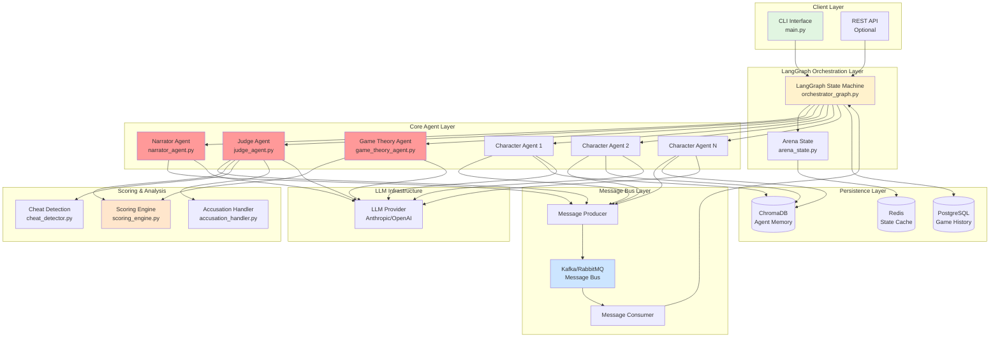
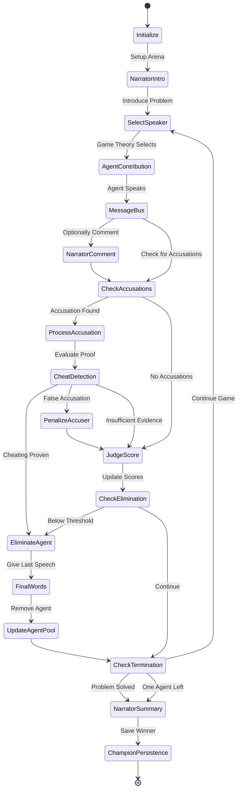
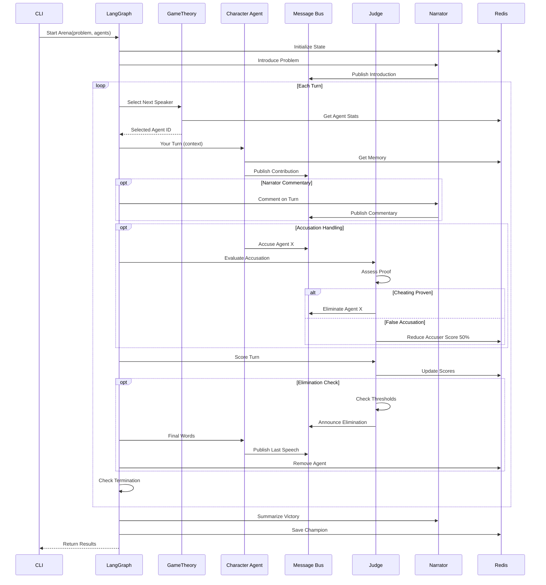

# High-Level Design: AI Agent Survival Arena

## System Architecture Overview



## LangGraph State Machine Flow



## Component Interaction Flow



## Tech Stack

### Core Framework
- **LangGraph**: Orchestration state machine
- **LangChain**: Agent framework and LLM integration
- **Python 3.11+**: Primary language

### LLM Providers
- **Anthropic Claude (Sonnet 4.5)**: Primary reasoning engine
- **OpenAI GPT-4**: Backup/comparison
- **Ollama (Local)**: Development/testing

### Message Bus
- **Apache Kafka**: Production (better for high-throughput, replay)
  - OR **RabbitMQ**: Simpler alternative
- **kafka-python** / **pika**: Python clients

### State Management
- **Redis**: Real-time state, agent scores, turn tracking
- **PostgreSQL**: Persistent game history, analytics
- **ChromaDB**: Vector store for agent memories

### Infrastructure
- **Docker Compose**: Local development
- **Kubernetes**: Production deployment (future)

### Monitoring & Observability
- **Prometheus**: Metrics
- **Grafana**: Dashboards
- **LangSmith**: LLM observability

### Development Tools
- **pytest**: Testing framework
- **black**: Code formatting
- **ruff**: Linting
- **mypy**: Type checking

## Project Structure

```
survival-arena/
├── docker-compose.yml          # Infrastructure definition
├── pyproject.toml             # Dependencies and config
├── README.md
├── .env.example
│
├── src/
│   ├── __init__.py
│   │
│   ├── main.py                # CLI entry point
│   │
│   ├── orchestration/
│   │   ├── __init__.py
│   │   ├── orchestrator_graph.py    # LangGraph state machine
│   │   ├── arena_state.py           # Arena state schema
│   │   └── transitions.py           # State transition logic
│   │
│   ├── agents/
│   │   ├── __init__.py
│   │   ├── base_agent.py            # Base agent class
│   │   ├── character_agent.py       # Character agents
│   │   ├── narrator_agent.py        # Narrator
│   │   ├── judge_agent.py           # Judge
│   │   └── game_theory_agent.py     # Turn selector
│   │
│   ├── message_bus/
│   │   ├── __init__.py
│   │   ├── producer.py              # Message publisher
│   │   ├── consumer.py              # Message subscriber
│   │   ├── schemas.py               # Message schemas
│   │   └── handlers.py              # Message handlers
│   │
│   ├── scoring/
│   │   ├── __init__.py
│   │   ├── scoring_engine.py        # Score calculation
│   │   ├── metrics.py               # Scoring metrics
│   │   ├── cheat_detector.py        # Cheating detection
│   │   └── accusation_handler.py    # Accusation logic
│   │
│   ├── persistence/
│   │   ├── __init__.py
│   │   ├── redis_client.py          # Redis operations
│   │   ├── postgres_client.py       # PostgreSQL operations
│   │   └── vector_store.py          # ChromaDB operations
│   │
│   ├── models/
│   │   ├── __init__.py
│   │   ├── agent.py                 # Agent data models
│   │   ├── message.py               # Message data models
│   │   ├── score.py                 # Score data models
│   │   └── game.py                  # Game data models
│   │
│   ├── config/
│   │   ├── __init__.py
│   │   ├── settings.py              # Configuration
│   │   └── prompts/                 # Agent prompts
│   │       ├── narrator.py
│   │       ├── judge.py
│   │       ├── game_theory.py
│   │       └── character_base.py
│   │
│   └── utils/
│       ├── __init__.py
│       ├── llm_client.py            # LLM abstraction
│       ├── logging.py               # Logging utilities
│       └── metrics.py               # Metrics collection
│
├── tests/
│   ├── __init__.py
│   ├── test_orchestrator.py
│   ├── test_agents.py
│   ├── test_scoring.py
│   └── test_message_bus.py
│
├── configs/
│   ├── scenarios/                   # Problem definitions
│   │   ├── philosophical_debate.yaml
│   │   ├── technical_problem.yaml
│   │   └── strategic_planning.yaml
│   │
│   └── agents/                      # Agent configurations
│       ├── character_profiles.yaml
│       └── scoring_weights.yaml
│
└── scripts/
    ├── setup_infrastructure.sh
    ├── run_arena.sh
    └── analyze_results.py
```

## Docker Compose Infrastructure

```yaml
# docker-compose.yml structure
services:
  # Message Bus
  kafka:
    image: confluentinc/cp-kafka:latest
    environment:
      - KAFKA_BROKER_ID=1
      - KAFKA_ZOOKEEPER_CONNECT=zookeeper:2181
    ports:
      - "9092:9092"
  
  zookeeper:
    image: confluentinc/cp-zookeeper:latest
    
  # State Management
  redis:
    image: redis:7-alpine
    ports:
      - "6379:6379"
      
  postgres:
    image: postgres:15-alpine
    environment:
      - POSTGRES_DB=survival_arena
    ports:
      - "5432:5432"
      
  # Vector Store
  chromadb:
    image: chromadb/chroma:latest
    ports:
      - "8000:8000"
      
  # Monitoring
  prometheus:
    image: prom/prometheus:latest
    ports:
      - "9090:9090"
      
  grafana:
    image: grafana/grafana:latest
    ports:
      - "3000:3000"
```

## Key Design Patterns from ai-talks

### 1. LangGraph State Machine Pattern
- Use typed state schemas (Pydantic)
- Define clear state transitions
- Conditional edges for branching logic

### 2. Agent Coordination Pattern
- Base agent class with common interface
- Specialized agents inherit and extend
- Message passing through centralized bus

### 3. State Persistence Pattern
- Redis for ephemeral state (current game)
- PostgreSQL for durable history
- Vector store for semantic memory

### 4. Turn Management Pattern
- Game theory engine calculates next speaker
- Payoff matrix based on agent performance
- Configurable selection strategies

## Data Models

```python
# Core data structures

@dataclass
class AgentState:
    agent_id: str
    name: str
    character_profile: Dict
    score: float
    turns_taken: int
    is_alive: bool
    memory: List[str]
    accusations_made: int
    false_accusations: int

@dataclass
class ArenaState:
    game_id: str
    problem_statement: str
    active_agents: List[AgentState]
    eliminated_agents: List[AgentState]
    message_history: List[Message]
    current_turn: int
    champion_from_previous: Optional[AgentState]
    scoring_weights: Dict[str, float]

@dataclass
class Message:
    message_id: str
    timestamp: datetime
    sender_id: str
    sender_type: str  # 'character', 'narrator', 'judge'
    content: str
    message_type: str  # 'contribution', 'accusation', 'elimination', etc.
    metadata: Dict

@dataclass
class ScoringMetrics:
    novelty: float
    builds_on_others: float
    solves_subproblem: float
    radical_idea: float
    manipulation_success: float
```

## LangGraph Node Definitions

```python
# Key nodes in the state machine

def initialize_arena(state: ArenaState) -> ArenaState:
    """Setup agents, problem, initial state"""
    
def narrator_introduction(state: ArenaState) -> ArenaState:
    """Narrator sets the scene"""
    
def game_theory_select_speaker(state: ArenaState) -> ArenaState:
    """Select next agent to speak"""
    
def agent_contribution(state: ArenaState) -> ArenaState:
    """Selected agent makes contribution"""
    
def process_accusations(state: ArenaState) -> ArenaState:
    """Handle any cheating accusations"""
    
def judge_scoring(state: ArenaState) -> ArenaState:
    """Judge updates scores"""
    
def check_elimination(state: ArenaState) -> ArenaState:
    """Determine if anyone should be eliminated"""
    
def eliminate_agent(state: ArenaState) -> ArenaState:
    """Handle elimination and final words"""
    
def check_termination(state: ArenaState) -> str:
    """Decide next state: 'continue', 'solved', 'one_survivor'"""
    
def finalize_game(state: ArenaState) -> ArenaState:
    """Narrator summary, save champion"""
```

## Configuration System

Following ai-talks pattern with YAML configs:

```yaml
# configs/scenarios/example.yaml
problem:
  title: "The Trolley Problem Reimagined"
  description: "Design an ethical AI system..."
  difficulty: 4
  expected_turns: 20
  
scoring:
  weights:
    novelty: 0.25
    builds_on_others: 0.20
    solves_subproblem: 0.25
    radical_idea: 0.15
    manipulation: 0.15
    
game_theory:
  mode: adversarial  # adversarial | collaborative | neutral
  selection_strategy: weighted_random
  chaos_factor: 0.3
  
judge:
  elimination_threshold: -10.0
  evaluation_frequency: every_turn
  reasoning_verbosity: high
  
narrator:
  commentary_frequency: 0.3  # 30% of turns
  emphasis_on: plot_twists
```
