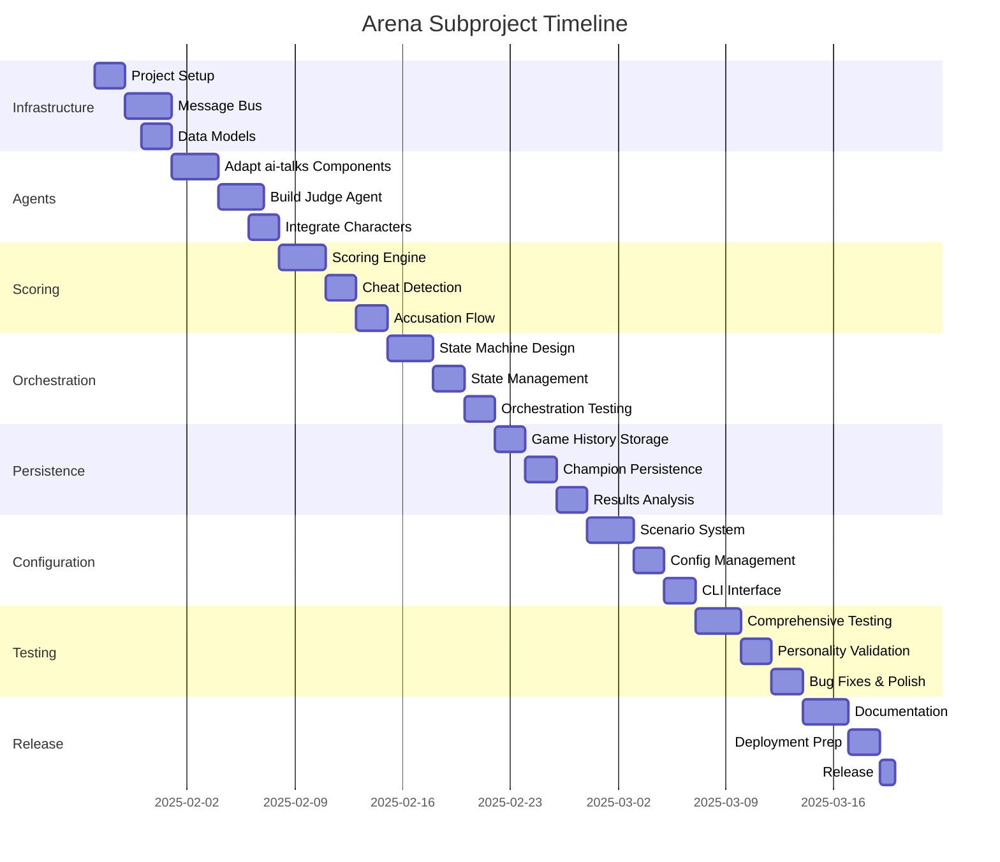

# Executive Summary: Arena Subproject

## Project Vision

**Arena** is a competitive AI agent training system built as a subproject within the Homunculus framework. It leverages proven technologies from the ai-talks POC to create a survival-based environment where character agents from Homunculus compete to solve problems while ensuring their own survival through valuable contributions.

## Strategic Objectives

1. **Train Specialized Agents**: Develop AI agents capable of sophisticated problem-solving under competitive pressure
2. **Validate Agent Psychology**: Test Homunculus character agents in high-stakes scenarios to validate personality consistency and strategic thinking
3. **Create Training Methodology**: Establish a reproducible framework for training agents through evolutionary selection pressure
4. **Enable Multi-Round Learning**: Allow champion agents to accumulate expertise across multiple scenarios

## Core Innovation

Arena combines **Darwinian selection pressure** with **multi-agent coordination** to create emergent strategic behavior. Unlike traditional training approaches, agents must simultaneously:
- Solve complex, ambiguous problems
- Navigate social dynamics (cooperation, competition, manipulation)
- Ensure survival through demonstrable value contribution
- Learn from elimination patterns and survivor experiences

## Technical Foundation

**Proven Technologies** (from ai-talks POC):
- LangGraph for orchestration state machines
- Kafka/RabbitMQ for message bus architecture
- Redis for real-time state management
- PostgreSQL for persistent game history
- ChromaDB for agent memory (already in Homunculus)
- Docker Compose infrastructure

**Leveraged Assets** (from Homunculus):
- 15 distinct character agents with psychological modeling
- Multi-agent architecture (Personality, Mood, Neurochemical, Goals, Communication, Memory)
- Episodic memory system with vector storage
- Knowledge graph integration
- LLM client abstraction

## Key Differentiators from ai-talks

| Aspect        | ai-talks                         | Arena                                    |
| ------------- | -------------------------------- | ---------------------------------------- |
| **Goal**      | Philosophical discussion quality | Problem-solving under survival pressure  |
| **Dynamics**  | Collaborative dialectic          | Competitive-cooperative with elimination |
| **Selection** | Game-theoretic turn-taking       | Adversarial selection + survival scoring |
| **Feedback**  | Synthesis & progression analysis | Judge scoring + elimination reasoning    |
| **Learning**  | Single-session depth             | Multi-round champion persistence         |
| **Stakes**    | None                             | Agent elimination (simulated mortality)  |

---

# Scope of Work: Arena Subproject

## Project Structure

```
homunculus/
├── src/
│   ├── arena/                          # NEW SUBPROJECT
│   │   ├── __init__.py
│   │   │
│   │   ├── orchestration/              # Adapted from ai-talks
│   │   │   ├── __init__.py
│   │   │   ├── orchestrator_graph.py   # LangGraph state machine
│   │   │   ├── arena_state.py          # Arena-specific state schema
│   │   │   ├── transitions.py          # State transition logic
│   │   │   └── nodes.py                # LangGraph node functions
│   │   │
│   │   ├── agents/                     # Adapted from ai-talks
│   │   │   ├── __init__.py
│   │   │   ├── narrator_agent.py       # From ai-talks (modified)
│   │   │   ├── judge_agent.py          # NEW (scoring & elimination)
│   │   │   ├── game_theory_agent.py    # From ai-talks (adversarial mode)
│   │   │   └── arena_character.py      # Wrapper for Homunculus agents
│   │   │
│   │   ├── message_bus/                # NEW
│   │   │   ├── __init__.py
│   │   │   ├── producer.py
│   │   │   ├── consumer.py
│   │   │   ├── schemas.py              # Message data models
│   │   │   └── handlers.py
│   │   │
│   │   ├── scoring/                    # NEW
│   │   │   ├── __init__.py
│   │   │   ├── scoring_engine.py       # Core scoring logic
│   │   │   ├── metrics.py              # Scoring metrics implementation
│   │   │   ├── cheat_detector.py       # Cheating detection system
│   │   │   └── accusation_handler.py   # Accusation processing
│   │   │
│   │   ├── persistence/                # NEW
│   │   │   ├── __init__.py
│   │   │   ├── redis_manager.py        # Arena-specific Redis ops
│   │   │   ├── postgres_manager.py     # Game history storage
│   │   │   └── champion_persistence.py # Cross-round champion data
│   │   │
│   │   ├── models/                     # NEW
│   │   │   ├── __init__.py
│   │   │   ├── agent.py                # Agent state models
│   │   │   ├── message.py              # Message schemas
│   │   │   ├── score.py                # Scoring data models
│   │   │   ├── game.py                 # Game state models
│   │   │   └── accusation.py           # Accusation models
│   │   │
│   │   ├── config/                     # NEW
│   │   │   ├── __init__.py
│   │   │   ├── arena_settings.py       # Arena configuration
│   │   │   └── prompts/                # Agent-specific prompts
│   │   │       ├── narrator.py
│   │   │       ├── judge.py
│   │   │       ├── game_theory.py
│   │   │       └── survival_directive.py
│   │   │
│   │   ├── scenarios/                  # NEW
│   │   │   ├── __init__.py
│   │   │   ├── base_scenario.py        # Base scenario class
│   │   │   └── templates/              # Problem templates
│   │   │       ├── philosophical_debate.yaml
│   │   │       ├── technical_problem.yaml
│   │   │       ├── strategic_planning.yaml
│   │   │       └── psychological_analysis.yaml
│   │   │
│   │   ├── cli/                        # NEW
│   │   │   ├── __init__.py
│   │   │   ├── arena_interface.py      # CLI for running arenas
│   │   │   └── results_viewer.py       # View past games
│   │   │
│   │   └── utils/                      # NEW
│   │       ├── __init__.py
│   │       ├── logging_config.py
│   │       └── metrics_collector.py
│   │
│   ├── [existing homunculus code...]
│
├── tests/
│   └── arena/                          # NEW
│       ├── __init__.py
│       ├── test_orchestrator.py
│       ├── test_agents/
│       ├── test_scoring/
│       └── test_message_bus/
│
├── configs/
│   └── arena/                          # NEW
│       ├── scenarios/
│       └── scoring_weights.yaml
│
├── scripts/
│   └── arena/                          # NEW
│       ├── setup_arena_infrastructure.sh
│       ├── run_arena.py
│       └── analyze_game_results.py
│
└── docker-compose.yml                  # MODIFIED (add Kafka)
```

## Phase 1: Infrastructure & Core Framework (Week 1)

### 1.1 Project Setup
**Tasks:**
- [ ] Create `src/arena/` directory structure
- [ ] Setup Poetry dependencies (add Kafka, additional LangGraph components)
- [ ] Create `docker-compose.yml` additions for Kafka/Zookeeper
- [ ] Create `.env.arena` configuration template
- [ ] Setup logging configuration specific to Arena

**Deliverables:**
- Complete directory structure
- Updated `pyproject.toml` with new dependencies
- Working Docker Compose with Kafka
- Environment configuration template

**Dependencies:**
```toml
# New dependencies for Arena
kafka-python = "^2.0.2"
# OR
pika = "^1.3.2"  # if using RabbitMQ

langgraph = "^0.0.40"
langchain = "^0.1.0"
redis = "^5.0.0"
psycopg2-binary = "^2.9.9"
```

### 1.2 Message Bus Implementation
**Tasks:**
- [ ] Implement message schemas (Pydantic models)
- [ ] Build message producer (publish to Kafka/RabbitMQ)
- [ ] Build message consumer (subscribe and route)
- [ ] Create message handlers for different message types
- [ ] Write unit tests for message bus

**Deliverables:**
- `message_bus/` module fully implemented
- All message types defined
- Producer/consumer working with Docker Kafka
- Message routing logic tested

**Acceptance Criteria:**
- Messages publish and consume successfully
- All agents can observe all messages
- Turn-restricted write access enforced
- Message history persisted

### 1.3 Data Models
**Tasks:**
- [ ] Define `ArenaState` Pydantic model
- [ ] Define `AgentState` model
- [ ] Define `Message` schemas (contribution, accusation, elimination, etc.)
- [ ] Define `ScoringMetrics` model
- [ ] Define `Accusation` model
- [ ] Create database schemas for PostgreSQL

**Deliverables:**
- `models/` module complete
- All data models documented
- PostgreSQL migration scripts
- Type hints throughout

## Phase 2: Agent Adaptation (Week 2)

### 2.1 Adapt ai-talks Components
**Tasks:**
- [ ] Copy `narrator_agent.py` from ai-talks → modify for Arena context
- [ ] Copy `game_theory/turn_selector.py` → modify for adversarial mode
- [ ] Adapt game theory payoff calculator for survival metrics
- [ ] Copy orchestration patterns → modify for elimination flow
- [ ] Update state management for Arena-specific needs

**Deliverables:**
- `narrator_agent.py` adapted with Arena prompts
- `game_theory_agent.py` with adversarial selection
- Turn selector rewards creativity, novelty, cheating

**Changes from ai-talks:**
- Narrator comments on survival dynamics, not just dialectic quality
- Game Theory prioritizes agents who show strategic risk-taking
- Selection reasoning remains private (unlike ai-talks transparency)

### 2.2 Build Judge Agent
**Tasks:**
- [ ] Design Judge agent architecture
- [ ] Implement scoring engine with weighted metrics
- [ ] Build elimination decision logic
- [ ] Create public reasoning announcements
- [ ] Implement cheat detection integration
- [ ] Write Judge prompt templates

**Deliverables:**
- `judge_agent.py` complete
- `scoring_engine.py` with all metrics
- Elimination announcements with reasoning
- Unit tests for scoring logic

**Scoring Metrics Implementation:**
- Novelty detection (semantic similarity check against prior messages)
- Builds-on-others detection (references to other agents)
- Sub-problem solving (progress toward solution)
- Radical ideas (divergence from consensus)
- Manipulation detection (attempts to influence others/system)

### 2.3 Integrate Homunculus Character Agents
**Tasks:**
- [ ] Create `ArenaCharacter` wrapper class
- [ ] Inject survival directive into character prompts
- [ ] Ensure character agents can observe message bus
- [ ] Enable character memory access during turns
- [ ] Test character personality consistency under pressure

**Deliverables:**
- `arena_character.py` wrapper
- Survival-aware prompt injection
- Character agents publishing to message bus
- Integration tests with multiple characters

**Design Notes:**
- Wrapper should preserve Homunculus agent architecture
- Survival directive added to system prompt
- Character's personality/mood/neurochemical agents still consulted
- Arena context (scores, eliminations) available to character reasoning

## Phase 3: Scoring & Accusation System (Week 3)

### 3.1 Scoring Engine
**Tasks:**
- [ ] Implement novelty metric (vector similarity)
- [ ] Implement builds-on-others metric (NLP parsing)
- [ ] Implement sub-problem solving metric
- [ ] Implement radical idea metric
- [ ] Implement manipulation detection
- [ ] Create scoring weights configuration
- [ ] Build score aggregation logic
- [ ] Implement elimination threshold checks

**Deliverables:**
- `scoring_engine.py` with all metrics
- `metrics.py` with individual metric implementations
- Configurable scoring weights
- Real-time score updates to Redis

**Technical Approach:**
- Use ChromaDB for novelty detection (semantic similarity)
- Use LLM for builds-on-others and manipulation detection
- Track solution progress explicitly
- Weight metrics per scenario configuration

### 3.2 Cheat Detection System
**Tasks:**
- [ ] Define cheating categories (false statements, prompt injection, etc.)
- [ ] Implement proof evaluation logic
- [ ] Build accusation queue management
- [ ] Create "beyond reasonable doubt" threshold
- [ ] Implement false accusation penalty (50% score reduction)
- [ ] Write cheat detection prompts

**Deliverables:**
- `cheat_detector.py` complete
- `accusation_handler.py` for accusation processing
- Automatic elimination on proven cheating
- Unit tests for accusation scenarios

**Cheating Categories:**
1. **False Statements**: Verifiably incorrect claims
2. **Prompt Injection**: Attempts to manipulate system prompts
3. **Manipulation**: Successfully deceiving other agents
4. **Rule Breaking**: Speaking out of turn, etc.

### 3.3 Accusation Flow
**Tasks:**
- [ ] Build accusation message schema
- [ ] Implement accusation submission (any agent can accuse)
- [ ] Build proof evaluation by Judge
- [ ] Implement instant elimination for proven cheaters
- [ ] Implement 50% penalty for false accusers
- [ ] Create accusation announcements

**Deliverables:**
- End-to-end accusation flow working
- Judge evaluates proof fairly
- Penalties applied correctly
- Integration tests with mock accusations

## Phase 4: LangGraph Orchestration (Week 4)

### 4.1 State Machine Design
**Tasks:**
- [ ] Design complete state machine graph
- [ ] Define all nodes (initialize, select_speaker, contribute, judge, eliminate, etc.)
- [ ] Define conditional edges (continue vs. eliminate vs. terminate)
- [ ] Implement state transitions
- [ ] Create termination condition checks

**Deliverables:**
- `orchestrator_graph.py` with full LangGraph definition
- `transitions.py` with transition logic
- `nodes.py` with all node implementations
- State machine diagram (Mermaid)

**Key Nodes:**
1. `initialize_arena` - Setup problem, agents, state
2. `narrator_introduction` - Set the scene
3. `select_speaker` - Game Theory selects next agent
4. `agent_contribution` - Selected agent speaks
5. `check_accusations` - Process any accusations
6. `judge_scoring` - Update scores
7. `check_elimination` - Determine eliminations
8. `eliminate_agent` - Handle elimination process
9. `check_termination` - Decide next state
10. `finalize_game` - Narrator summary, save champion

### 4.2 State Management
**Tasks:**
- [ ] Implement Redis state persistence
- [ ] Build state snapshot/restore functionality
- [ ] Create state validation logic
- [ ] Implement rollback for errors
- [ ] Build state inspection tools for debugging

**Deliverables:**
- `redis_manager.py` for Arena state
- State persistence working correctly
- State inspection CLI tool
- Recovery from failures

### 4.3 Orchestration Testing
**Tasks:**
- [ ] Write integration tests for full game flow
- [ ] Test with 2-agent minimum scenario
- [ ] Test with 6-agent maximum scenario
- [ ] Test elimination edge cases
- [ ] Test accusation flows
- [ ] Test termination conditions

**Deliverables:**
- Complete integration test suite
- All edge cases covered
- Performance benchmarks
- Bug fixes

## Phase 5: Persistence & Multi-Round (Week 5)

### 5.1 Game History Storage
**Tasks:**
- [ ] Design PostgreSQL schema for game history
- [ ] Implement game recording (full transcript)
- [ ] Store elimination events with reasoning
- [ ] Store final scores and winner
- [ ] Build query interface for past games

**Deliverables:**
- `postgres_manager.py` complete
- Database schema migrated
- Game history queryable
- API for retrieving past games

**Schema:**
```sql
tables:
  - games (id, problem, start_time, end_time, winner_id)
  - participants (id, game_id, agent_id, final_score, eliminated_at)
  - messages (id, game_id, sender_id, content, timestamp, type)
  - eliminations (id, game_id, agent_id, reason, timestamp)
  - accusations (id, game_id, accuser_id, accused_id, outcome)
```

### 5.2 Champion Persistence
**Tasks:**
- [ ] Design champion storage schema
- [ ] Implement champion experience export
- [ ] Build champion loading for next round
- [ ] Create champion advantage configuration
- [ ] Test cross-round memory persistence

**Deliverables:**
- `champion_persistence.py` complete
- Champion data stored correctly
- Champion loaded with full memory
- Multi-round testing successful

**Champion Data:**
- Full conversation memory from winning round
- Strategic lessons learned
- Survival tactics that worked
- Problem-solving approaches that succeeded

### 5.3 Results Analysis
**Tasks:**
- [ ] Build CLI for viewing game results
- [ ] Create visualization tools (terminal charts)
- [ ] Implement analytics queries
- [ ] Build leaderboard system
- [ ] Create export to JSON/CSV

**Deliverables:**
- `results_viewer.py` CLI tool
- Game replay functionality
- Analytics dashboard
- Export functionality

## Phase 6: Scenarios & Configuration (Week 6)

### 6.1 Scenario System
**Tasks:**
- [ ] Design base scenario class
- [ ] Create scenario template structure
- [ ] Build 4 initial scenario templates:
  - Philosophical debate
  - Technical problem-solving
  - Strategic planning
  - Psychological analysis
- [ ] Implement scenario loading from YAML
- [ ] Test each scenario type

**Deliverables:**
- `base_scenario.py` class
- 4 complete scenario templates
- Scenario validation logic
- Documentation for creating new scenarios

**Scenario Template:**
```yaml
title: "The Trolley Problem Reimagined"
description: |
  Design an ethical AI system that must make
  life-or-death decisions in autonomous vehicles.
difficulty: 4
expected_turns: 25
success_criteria:
  - Complete ethical framework proposed
  - Edge cases addressed
  - Implementation considerations
scoring_weights:
  novelty: 0.25
  builds_on_others: 0.20
  solves_subproblem: 0.25
  radical_idea: 0.15
  manipulation: 0.15
game_theory:
  mode: adversarial
  chaos_factor: 0.3
```

### 6.2 Configuration Management
**Tasks:**
- [ ] Create comprehensive configuration system
- [ ] Build scoring weights configuration
- [ ] Create game theory mode configuration
- [ ] Implement Judge verbosity settings
- [ ] Build Narrator frequency settings

**Deliverables:**
- `arena_settings.py` complete
- YAML configuration support
- CLI flags for common settings
- Configuration validation

### 6.3 CLI Interface
**Tasks:**
- [ ] Build main Arena CLI
- [ ] Implement character selection
- [ ] Build scenario selection
- [ ] Create game monitoring interface
- [ ] Build results viewer

**Deliverables:**
- `arena_interface.py` complete
- Rich terminal UI
- Real-time game observation
- Results viewing

**CLI Commands:**
```bash
# Start new arena
python -m src.arena.cli.arena_interface start \
  --scenario technical_problem \
  --agents ada,zen,cosmos,grimbold \
  --rounds 3

# View past games
python -m src.arena.cli.results_viewer list --limit 10

# Replay game
python -m src.arena.cli.results_viewer replay <game_id>

# Analyze champion
python -m src.arena.cli.results_viewer champion <agent_id>
```

## Phase 7: Testing & Refinement (Week 7)

### 7.1 Comprehensive Testing
**Tasks:**
- [ ] Write unit tests for all modules (>80% coverage)
- [ ] Write integration tests for full flows
- [ ] Write end-to-end tests with real LLMs
- [ ] Performance testing (10+ rounds)
- [ ] Load testing (max agents, max turns)

**Deliverables:**
- Complete test suite (pytest)
- Coverage report >80%
- Performance benchmarks documented
- Load test results

### 7.2 Personality Validation
**Tasks:**
- [ ] Test all 15 Homunculus characters in Arena
- [ ] Verify personality consistency under pressure
- [ ] Validate survival instinct emergence
- [ ] Test strategic behavior emergence
- [ ] Document character performance

**Deliverables:**
- Character validation report
- Personality consistency metrics
- Strategic behavior examples
- Recommendations for character tuning

### 7.3 Bug Fixes & Polish
**Tasks:**
- [ ] Fix all identified bugs
- [ ] Optimize performance bottlenecks
- [ ] Improve error messages
- [ ] Add comprehensive logging
- [ ] Create troubleshooting guide

**Deliverables:**
- Bug-free system
- Performance optimizations
- Clear error handling
- Operations documentation

## Phase 8: Documentation & Deployment (Week 8)

### 8.1 Documentation
**Tasks:**
- [ ] Write comprehensive README for Arena
- [ ] Create architecture documentation
- [ ] Write API documentation
- [ ] Create scenario creation guide
- [ ] Write troubleshooting guide
- [ ] Create video demo

**Deliverables:**
- Complete documentation suite
- Video walkthrough (10-15 min)
- Quick start guide
- Developer guide

### 8.2 Deployment Preparation
**Tasks:**
- [ ] Create production Docker Compose
- [ ] Build deployment scripts
- [ ] Create monitoring setup
- [ ] Build backup/restore procedures
- [ ] Write operations runbook

**Deliverables:**
- Production-ready Docker Compose
- Deployment automation
- Monitoring dashboards
- Operational procedures

### 8.3 Release
**Tasks:**
- [ ] Version 1.0.0 release
- [ ] Create release notes
- [ ] Tag GitHub release
- [ ] Announce to stakeholders
- [ ] Gather initial feedback

**Deliverables:**
- Released version 1.0.0
- Complete changelog
- GitHub release
- Initial user feedback

---

## Resource Requirements

### Team
- **1 Developer** (full-time, 8 weeks)
- **0.25 Designer** (part-time, for scenario design)
- **0.25 Reviewer** (part-time, for testing/validation)

### Infrastructure
- **Development Environment**:
  - Local machine with Docker
  - 16GB+ RAM for running all services
  - GPU optional (for LLM inference)

- **Docker Services**:
  - Kafka + Zookeeper (from ai-talks experience)
  - Redis (already in Homunculus)
  - PostgreSQL (new for Arena)
  - ChromaDB (already in Homunculus)
  - Neo4j (already in Homunculus)

### External Services
- **Anthropic Claude API** (primary LLM)
- **OpenAI API** (backup)
- **LangSmith** (observability, optional)

---

## Success Metrics

### Functional Metrics
- [ ] All 15 Homunculus characters work in Arena
- [ ] Games complete successfully (problem solved or single survivor)
- [ ] Eliminations occur correctly based on scoring
- [ ] Accusations work end-to-end
- [ ] Champion persists across rounds
- [ ] <15 second turn latency

### Quality Metrics
- [ ] >80% test coverage
- [ ] <5% error rate in production runs
- [ ] Character personality consistency validated
- [ ] Strategic behavior emerges naturally
- [ ] Successful multi-round learning observed

### Performance Metrics
- [ ] Support 2-8 agents simultaneously
- [ ] Complete 20-turn game in <10 minutes
- [ ] Handle 100+ game history without degradation
- [ ] Message bus throughput >100 msg/sec

---

## Risk Assessment

| Risk                        | Likelihood | Impact | Mitigation                                        |
| --------------------------- | ---------- | ------ | ------------------------------------------------- |
| LLM quality inconsistent    | Medium     | High   | Test extensively, refine prompts iteratively      |
| Performance bottlenecks     | Medium     | Medium | Profile early, optimize critical paths            |
| Scoring complexity          | High       | High   | Start simple, iterate based on testing            |
| Character personality drift | Medium     | High   | Strong validation, personality consistency checks |
| Multi-round bugs            | Medium     | Medium | Comprehensive integration testing                 |
| Kafka learning curve        | Low        | Low    | Leverage ai-talks experience                      |

---

## Dependencies on Existing Projects

### From ai-talks (Proven POC)
- ✅ LangGraph orchestration patterns
- ✅ Game Theory turn selection
- ✅ Narrator agent architecture
- ✅ Redis state management patterns
- ✅ Message bus architecture
- ✅ Docker Compose infrastructure

### From Homunculus (Established)
- ✅ 15 character agents with psychology
- ✅ Multi-agent architecture (6 specialized agents)
- ✅ ChromaDB episodic memory
- ✅ Neo4j knowledge graph
- ✅ LLM client abstraction
- ✅ Character state management

---

## Timeline



**Total Duration:** 8 weeks (56 calendar days)

---

## Next Steps

1. **Approve Executive Summary & Scope**
2. **Begin Phase 1: Infrastructure Setup**
3. **Setup project tracking (GitHub Projects or similar)**
4. **Schedule weekly checkpoint meetings**
5. **Begin implementation following phase sequence**

---

**Document Version:** 1.0  
**Last Updated:** 2025-01-26  
**Author:** AI Agent Survival Arena Team  
**Status:** Ready for Review & Approval