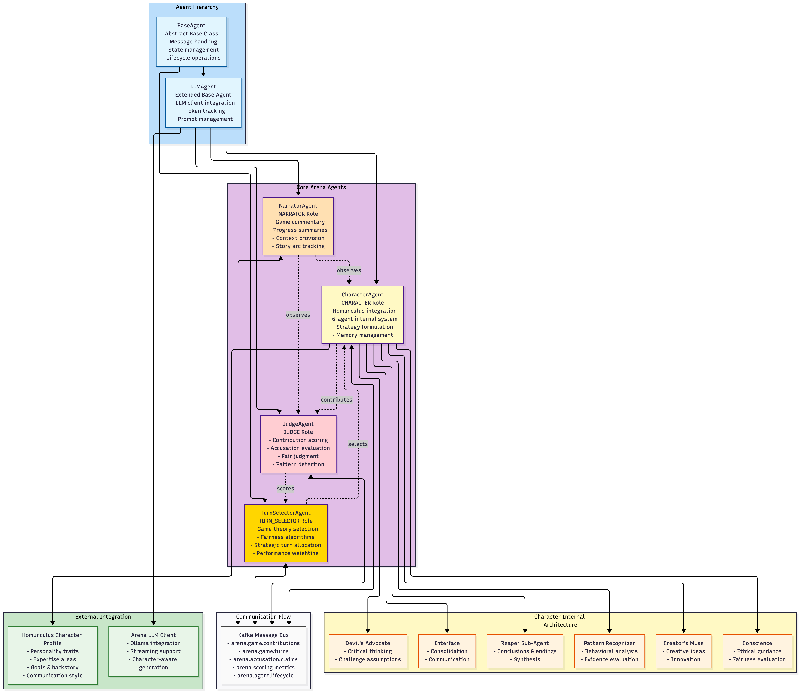

# Arena Agent Architecture

This diagram illustrates the core agent ecosystem that functions as an AI persona in the Arena competitive environment.

## Agent Roles & Responsibilities

### **BaseAgent** (Abstract)
- **Purpose**: Foundation for all Arena agents
- **Key Features**: Message handling, state management, lifecycle operations, async support
- **Role**: Provides common agent infrastructure and interface

### **LLMAgent** (Abstract)
- **Purpose**: Base class for LLM-powered agents
- **Key Features**: LLM client integration, token tracking, conversation history, prompt management
- **Role**: Extends BaseAgent with language model capabilities

### **CharacterAgent** (Character Role)
- **Purpose**: Represents a Homunculus character in Arena competitions
- **Key Features**: 
  - Wraps Homunculus character profiles
  - Internal 6-agent deliberation system
  - Strategy formulation and memory management
  - Champion preservation capabilities
- **Internal Architecture**: 6 specialized sub-agents for comprehensive decision making
- **Role**: Primary competitive participant with rich personality and strategic depth

### **JudgeAgent** (Judge Role)
- **Purpose**: Evaluates contributions and maintains game fairness
- **Key Features**:
  - Multi-dimensional contribution scoring
  - Accusation evaluation with "beyond reasonable doubt" standard
  - Pattern detection for manipulation
  - Consistent and fair judgment
- **Role**: Objective evaluator ensuring competitive integrity

### **NarratorAgent** (Narrator Role)
- **Purpose**: Provides commentary and context for game proceedings
- **Key Features**:
  - Periodic summaries of game state
  - Context provision for new participants
  - Narrative arc tracking
  - Dramatic moment highlighting
- **Role**: Storyteller and context provider enhancing engagement

### **TurnSelectorAgent** (Turn Selector Role)
- **Purpose**: Manages speaking order using game theory principles
- **Key Features**:
  - Fairness algorithms ensuring equal opportunity
  - Merit-based weighting for performance
  - Diversity promotion to avoid repetition
  - Tension creation for dramatic moments
- **Role**: Strategic facilitator managing conversation flow

## Character Internal Architecture

The **CharacterAgent** contains 6 specialized sub-agents that work together to create nuanced, character-appropriate responses:

1. **Reaper**: Focuses on conclusions and synthesis
2. **Creator's Muse**: Generates creative and innovative ideas
3. **Conscience**: Provides ethical guidance and fairness evaluation
4. **Devil's Advocate**: Applies critical thinking and challenges assumptions
5. **Pattern Recognizer**: Analyzes behavioral patterns and evaluates evidence
6. **Interface**: Consolidates perspectives and manages communication

## Message Bus Integration

All agents communicate through a Kafka-based message bus with specialized topics:
- `arena.game.contributions` - Main discussion contributions
- `arena.game.turns` - Turn selection and management
- `arena.accusation.claims` - Cheating accusations and defenses
- `arena.scoring.metrics` - Performance scoring and feedback
- `arena.agent.lifecycle` - Agent state changes and eliminations

## Key Design Principles

1. **Modularity**: Each agent has a specific, well-defined role
2. **Scalability**: Message bus enables distributed agent communication
3. **Fairness**: Multiple systems ensure equitable competition
4. **Personality**: Character agents maintain authentic personas through internal architecture
5. **Transparency**: All decisions include explanations and reasoning
6. **Adaptability**: Agents learn and adapt based on performance feedback

This architecture creates a sophisticated AI persona capable of complex strategic thinking, authentic character representation, and fair competitive participation in Arena games.