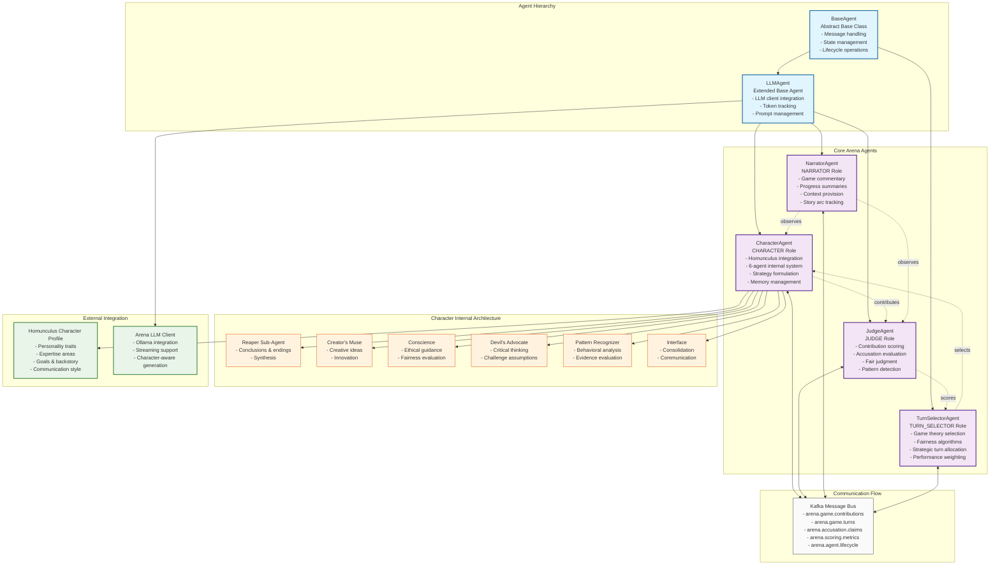

```mermaid
graph TB
    subgraph "Agent Hierarchy"
        BaseAgent[BaseAgent<br/>Abstract Base Class<br/>- Message handling<br/>- State management<br/>- Lifecycle operations]
        LLMAgent[LLMAgent<br/>Extended Base Agent<br/>- LLM client integration<br/>- Token tracking<br/>- Prompt management]
        
        BaseAgent --> LLMAgent
    end

    subgraph "Core Arena Agents"
        CharacterAgent[CharacterAgent<br/>CHARACTER Role<br/>- Homunculus integration<br/>- 6-agent internal system<br/>- Strategy formulation<br/>- Memory management]
        
        JudgeAgent[JudgeAgent<br/>JUDGE Role<br/>- Contribution scoring<br/>- Accusation evaluation<br/>- Fair judgment<br/>- Pattern detection]
        
        NarratorAgent[NarratorAgent<br/>NARRATOR Role<br/>- Game commentary<br/>- Progress summaries<br/>- Context provision<br/>- Story arc tracking]
        
        TurnSelectorAgent[TurnSelectorAgent<br/>TURN_SELECTOR Role<br/>- Game theory selection<br/>- Fairness algorithms<br/>- Strategic turn allocation<br/>- Performance weighting]
    end

    subgraph "Character Internal Architecture"
        Reaper[Reaper Sub-Agent<br/>- Conclusions & endings<br/>- Synthesis]
        CreatorsMuse[Creator's Muse<br/>- Creative ideas<br/>- Innovation]
        Conscience[Conscience<br/>- Ethical guidance<br/>- Fairness evaluation]
        DevilAdvocate[Devil's Advocate<br/>- Critical thinking<br/>- Challenge assumptions]
        PatternRecognizer[Pattern Recognizer<br/>- Behavioral analysis<br/>- Evidence evaluation]
        Interface[Interface<br/>- Consolidation<br/>- Communication]
    end

    subgraph "Communication Flow"
        MessageBus[Kafka Message Bus<br/>- arena.game.contributions<br/>- arena.game.turns<br/>- arena.accusation.claims<br/>- arena.scoring.metrics<br/>- arena.agent.lifecycle]
    end

    subgraph "External Integration"
        HomunculusProfile[Homunculus Character Profile<br/>- Personality traits<br/>- Expertise areas<br/>- Goals & backstory<br/>- Communication style]
        
        LLMClient[Arena LLM Client<br/>- Ollama integration<br/>- Streaming support<br/>- Character-aware generation]
    end

    %% Inheritance relationships
    LLMAgent --> CharacterAgent
    LLMAgent --> JudgeAgent
    LLMAgent --> NarratorAgent
    BaseAgent --> TurnSelectorAgent

    %% Character internal system
    CharacterAgent --> Reaper
    CharacterAgent --> CreatorsMuse
    CharacterAgent --> Conscience
    CharacterAgent --> DevilAdvocate
    CharacterAgent --> PatternRecognizer
    CharacterAgent --> Interface

    %% External dependencies
    CharacterAgent --> HomunculusProfile
    LLMAgent --> LLMClient

    %% Message flow
    CharacterAgent <--> MessageBus
    JudgeAgent <--> MessageBus
    NarratorAgent <--> MessageBus
    TurnSelectorAgent <--> MessageBus

    %% Interaction patterns
    TurnSelectorAgent -.->|selects| CharacterAgent
    CharacterAgent -.->|contributes| JudgeAgent
    JudgeAgent -.->|scores| TurnSelectorAgent
    NarratorAgent -.->|observes| CharacterAgent
    NarratorAgent -.->|observes| JudgeAgent

    %% Styling
    classDef baseClass fill:#e1f5fe,stroke:#01579b,stroke-width:2px
    classDef coreAgent fill:#f3e5f5,stroke:#4a148c,stroke-width:2px
    classDef internalAgent fill:#fff3e0,stroke:#e65100,stroke-width:1px
    classDef external fill:#e8f5e8,stroke:#2e7d32,stroke-width:2px
    classDef infrastructure fill:#fafafa,stroke:#424242,stroke-width:1px

    class BaseAgent,LLMAgent baseClass
    class CharacterAgent,JudgeAgent,NarratorAgent,TurnSelectorAgent coreAgent
    class Reaper,CreatorsMuse,Conscience,DevilAdvocate,PatternRecognizer,Interface internalAgent
    class HomunculusProfile,LLMClient external
    class MessageBus infrastructure
```