# Game Orchestrator Flow

This diagram illustrates the LangGraph-based game orchestration flow that manages the complete Arena game lifecycle.

```mermaid
graph TB
    subgraph "Initialization Phase"
        START[🚀 START<br/>Initialize game state<br/>- Set game_id, turn=0<br/>- Initialize active_agents<br/>- Set phase=EARLY<br/>- Clear scores & messages]
        SETUP[⚙️ SETUP<br/>Setup game components<br/>- Initialize agents<br/>- Setup state manager<br/>- Generate opening announcement]
    end

    subgraph "Main Game Loop"
        TURN_START[🔄 TURN_START<br/>Start new turn<br/>- Increment turn counter<br/>- Log turn start<br/>- Clear turn messages<br/>- Create checkpoint if needed]
        
        AGENT_SELECT[👤 AGENT_SELECT<br/>Select next speaker<br/>- Filter gameplay agents<br/>- Round-robin selection<br/>- Skip narrator/judge]
        
        AGENT_ACTION[💬 AGENT_ACTION<br/>Execute agent action<br/>- Generate agent contribution<br/>- Provide context & history<br/>- Include seed question]
        
        MESSAGE_PROCESS[📨 MESSAGE_PROCESS<br/>Process messages<br/>- Store in conversation history<br/>- Route to all agents<br/>- Parallel/sequential processing]
        
        SCORING[🎯 SCORING<br/>Score contributions<br/>- Multi-dimensional scoring<br/>- Update agent scores<br/>- Log scoring events]
        
        ELIMINATION_CHECK[❓ ELIMINATION_CHECK<br/>Check elimination conditions<br/>- Turn > 20 & turn % 10 == 0<br/>- More than min_agents active<br/>- Set elimination_pending]
    end

    subgraph "Conditional Processing"
        ELIMINATION[❌ ELIMINATION<br/>Process eliminations<br/>- Create elimination context<br/>- Process elimination round<br/>- Remove eliminated agents<br/>- Log eliminations]
        
        PHASE_CHECK[🎭 PHASE_CHECK<br/>Check & update phase<br/>- Determine phase by turn count<br/>- Check elimination rate<br/>- Update game phase<br/>- Check game over conditions]
        
        TURN_END[✅ TURN_END<br/>End current turn<br/>- Update state manager<br/>- Log turn completion<br/>- Prepare for next turn]
    end

    subgraph "Game Completion"
        GAME_END[🏁 GAME_END<br/>End the game<br/>- Determine winner<br/>- Calculate final statistics<br/>- Log game completion]
        
        NARRATOR_FINAL[🎭 NARRATOR_FINAL<br/>Final narrator summary<br/>- Generate final summary<br/>- Reflect on game arc<br/>- Provide closure]
        
        JUDGE_FINAL[⚖️ JUDGE_FINAL<br/>Final judge verdict<br/>- Generate final verdict<br/>- Validate winner<br/>- Provide detailed reasoning]
        
        END_STATE[🔚 END<br/>Game Complete]
    end

    subgraph "Error Handling"
        ERROR[💥 ERROR<br/>Handle errors<br/>- Log error details<br/>- Attempt recovery<br/>- Restore from checkpoint<br/>- Set game_over]
    end

    %% Main flow
    START --> SETUP
    SETUP --> TURN_START
    TURN_START --> AGENT_SELECT
    AGENT_SELECT --> AGENT_ACTION
    AGENT_ACTION --> MESSAGE_PROCESS
    MESSAGE_PROCESS --> SCORING
    SCORING --> ELIMINATION_CHECK

    %% Elimination decision
    ELIMINATION_CHECK -->|elimination_pending=True| ELIMINATION
    ELIMINATION_CHECK -->|elimination_pending=False| PHASE_CHECK
    ELIMINATION --> PHASE_CHECK

    %% Game over decision
    PHASE_CHECK -->|game_over=True| GAME_END
    PHASE_CHECK -->|game_over=False| TURN_END

    %% Continue or end game
    TURN_END -->|!game_over| TURN_START
    TURN_END -->|game_over| GAME_END

    %% Final sequence
    GAME_END --> NARRATOR_FINAL
    NARRATOR_FINAL --> JUDGE_FINAL
    JUDGE_FINAL --> END_STATE

    %% Error handling (can happen from any node)
    AGENT_SELECT -.->|error| ERROR
    AGENT_ACTION -.->|error| ERROR
    MESSAGE_PROCESS -.->|error| ERROR
    SCORING -.->|error| ERROR
    ERROR --> END_STATE

    %% Decision conditions
    classDef startNode fill:#e8f5e8,stroke:#2e7d32,stroke-width:3px
    classDef processNode fill:#e3f2fd,stroke:#0277bd,stroke-width:2px
    classDef decisionNode fill:#fff3e0,stroke:#ef6c00,stroke-width:2px
    classDef endNode fill:#fce4ec,stroke:#ad1457,stroke-width:3px
    classDef errorNode fill:#ffebee,stroke:#c62828,stroke-width:2px

    class START startNode
    class SETUP,TURN_START,AGENT_SELECT,AGENT_ACTION,MESSAGE_PROCESS,SCORING,TURN_END processNode
    class ELIMINATION_CHECK,PHASE_CHECK decisionNode
    class ELIMINATION processNode
    class GAME_END,NARRATOR_FINAL,JUDGE_FINAL,END_STATE endNode
    class ERROR errorNode
```

## Key Components

### **Game State (TypedDict)**
- `game_id`: Unique game identifier
- `turn`: Current turn number  
- `phase`: Current game phase (EARLY/MID/LATE/FINAL)
- `active_agents`: List of participating agent IDs
- `eliminated_agents`: List of eliminated agent IDs
- `scores`: Agent score dictionary
- `messages`: Current turn messages
- `current_speaker`: Selected agent for current turn
- `elimination_pending`: Whether elimination should occur
- `game_over`: Game termination flag
- `error`: Error message if any
- `metadata`: Additional game information

### **Game Flow Phases**

#### **Initialization**
1. **START**: Initialize game state with default values
2. **SETUP**: Initialize agents and generate opening announcement

#### **Main Game Loop**
3. **TURN_START**: Begin new turn, increment counter, checkpoint
4. **AGENT_SELECT**: Round-robin selection of gameplay agents (excludes narrator/judge)
5. **AGENT_ACTION**: Selected agent generates contribution with full context
6. **MESSAGE_PROCESS**: Route messages to all agents, update conversation history
7. **SCORING**: Multi-dimensional scoring of contributions, update agent scores

#### **Conditional Processing**
8. **ELIMINATION_CHECK**: Check if elimination round should occur (turn > 20, every 10 turns)
9. **ELIMINATION**: Process elimination round if pending, remove lowest performers
10. **PHASE_CHECK**: Update game phase based on turn count and elimination rate
11. **TURN_END**: Complete turn, check continuation conditions

#### **Game Completion**
12. **GAME_END**: Determine winner, calculate final statistics
13. **NARRATOR_FINAL**: Generate comprehensive final summary
14. **JUDGE_FINAL**: Generate final verdict with detailed reasoning

### **Decision Points**

#### **Elimination Decision** (`_should_eliminate`)
- **True**: Proceed to ELIMINATION node
- **False**: Skip to PHASE_CHECK node

#### **Game Over Check** (`_check_game_over`)
- **True**: Proceed to GAME_END sequence
- **False**: Continue to TURN_END

#### **Continue Check** (`_should_continue`)
- **True**: Loop back to TURN_START for next turn
- **False**: End game

### **Error Handling**
- Any node can trigger error handling
- Attempts checkpoint recovery if enabled
- Gracefully terminates game on unrecoverable errors

### **Key Features**

1. **LangGraph Integration**: Uses LangGraph StateGraph for robust state management
2. **Checkpointing**: Automatic checkpoints for recovery (every 5 turns by default)
3. **Parallel Execution**: Optional parallel agent processing for performance
4. **Phase Management**: Dynamic phase transitions based on game progress
5. **Special Agent Handling**: Narrator and Judge excluded from normal gameplay
6. **Conversation Context**: Full message history provided to agents for context-aware responses
7. **Flexible Termination**: Multiple end conditions (max turns, min agents, manual)
8. **Comprehensive Logging**: Detailed Arena-specific logging throughout flow

### **Configuration Options**
- `max_turns`: Maximum game turns (default: 100)
- `min_agents`: Minimum agents before ending (default: 3)  
- `checkpoint_frequency`: Turns between checkpoints (default: 5)
- `recursion_limit`: LangGraph recursion limit (default: 250)
- `timeout_seconds`: Operation timeout (default: 300)
- `parallel_execution`: Enable parallel agent processing (default: True)

This architecture ensures robust, scalable game orchestration with proper state management, error handling, and extensibility for future enhancements.